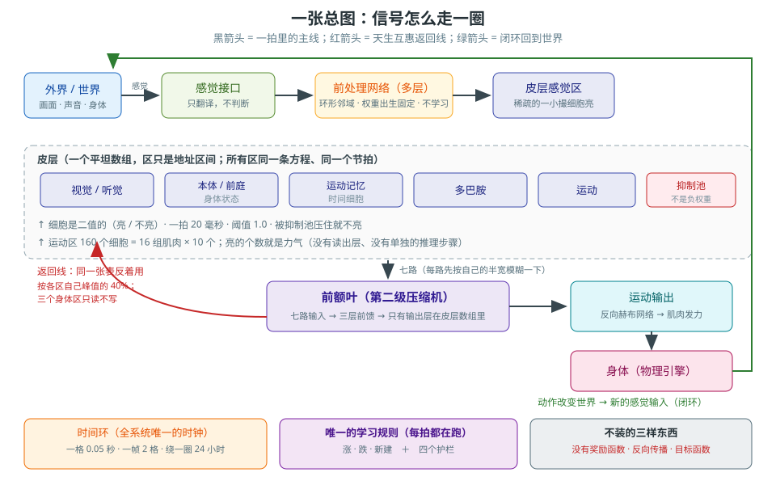
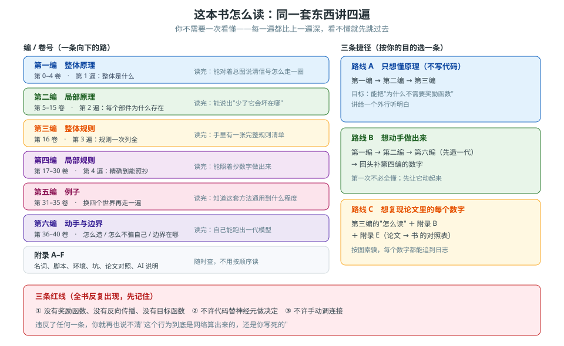

# 生来就有连接
## 自己动手做一套会学习的大脑（通用教程）

> **一句话**：这套方法**不要奖励函数、不要反向传播、不要目标函数**。
> 它靠三样东西——**生下来就写好的连接**、**一条局部学习规则**、**一个闭环的身体**——
> 让一个模型自己站起来、走起来、看见红球走过去、眼睛自己盯住移动的球。
>
> **这是一本通用教程，不是"做机器狗"的教程。**
> 机器狗只是四个例子里最大的那一个。同一套方法，换成小球、换成文字、换成别的人形，都能用。

*图：一拍里信号怎么走一圈。全书就是把这张图拆开，一个框一个框地讲透。*

---

## 三条红线（全书反复出现，先记住）

| 红线 | 意思 | 为什么 |
|---|---|---|
| **不要奖励函数、不要反向传播、不要目标函数** | 学的东西只有连接权重 | 这是这套方法要证明的事，不是省事 |
| **不许代码替神经元做决定** | 一切都是神经元决定的：判断只发生在细胞和连接上 | 代码一替细胞做决定，你就再也说不清行为是哪来的 |
| **不许手动调连接** | 随机生成 + 考试 + 筛选，才是改行为的主路 | 手调出来的行为没法复现，也长不大 |

---

## 怎么读这本书

*图：向下的那条路是六编的顺序，右边是三条捷径。选了路线就照着走，不用按顺序全读。*

**路线 A：只想懂原理**（不写代码）
按顺序读「第一编 整体原理」→「第二编 局部原理」→「第三编 整体规则」。
读完你能对着总图，把信号怎么走一圈、为什么不需要奖励函数讲清楚。

**路线 B：想动手做出来**
读「第一编」→「第二编」，然后直接跳到「第六编 怎么造下一代」，
照着做出一代模型，再回头补「第四编 局部规则」里的数字。

**路线 C：想复现论文里的每个数字**
「第三编 整体规则」的"怎么读"那一节 +「附录 B 每个数字配哪个脚本 + 哪份日志」，
按图索骥，每个数字都能追到当时的日志。

---

## 同一套东西，讲四遍

| 编 | 讲哪一遍 | 读者读完能做什么 |
|---|---|---|
| **第一编　整体原理** | 第 1 遍：**整体是什么** | 说出信号怎么走一圈、为什么不需要奖励函数 |
| **第二编　局部原理** | 第 2 遍：**每个部件为什么存在** | 说出"少了它会坏在哪" |
| **第三编　整体规则** | 第 3 遍：**整个系统的规则一次列全** | 拿到一张能自查的规则总表 |
| **第四编　局部规则** | 第 4 遍：**每个部件的精确规则** | 照着抄数字就能实现 |
| **第五编　例子** | 换个世界再来一遍 | 把同一套方法搬到自己的问题上 |
| **第六编　动手与边界** | 怎么造、怎么不骗自己、哪里还不成立 | 真的做出一代模型 |

---

## 目录

**第一编　整体原理**（第 1 遍：整体是什么）
- 第 0 卷　读这本书之前
- 第 1 卷　这套方法在解决什么问题
- 第 2 卷　一张总图，走一圈
- 第 3 卷　为什么"生下来就有连接"能成立
- 第 4 卷　为什么"一条局部规则"就够

**第二编　局部原理**（第 2 遍：每个部件为什么存在）
- 第 5 卷　细胞与连接　／　第 6 卷　特征神经元与表示　／　第 7 卷　前处理网络
- 第 8 卷　学习规则　／　第 9 卷　相反神经元　／　第 10 卷　时间与记忆
- 第 11 卷　运动输出　／　第 12 卷　本能与标定　／　第 13 卷　前额叶
- 第 14 卷　专注与抑制　／　第 15 卷　身体与感觉接口

**第三编　整体规则**（第 3 遍：规则一次列全）
- 第 16 卷　规则总表

**第四编　局部规则**（第 4 遍：精确到能照抄）
- 第 17 卷　细胞与连接的精确规则　／　第 18 卷　特征神经元的精确规则
- 第 19 卷　前处理网络的精确规则　／　第 20 卷　学习规则的精确规则
- 第 21 卷　相反神经元的精确规则　／　第 22 卷　时间与记忆的精确规则
- 第 23 卷　运动输出的精确规则　／　第 24 卷　本能表与标定的精确规则
- 第 25 卷　前额叶的精确规则　／　第 26 卷　专注与抑制的精确规则
- 第 27 卷　眼睛的精确规则　／　第 28 卷　耳朵的精确规则
- 第 29 卷　规模与代价的精确数字　／　第 30 卷　常见坑清单

**第五编　例子**（同一套方法，换四个世界）
- 第 31 卷　例子一：最小小球　／　第 32 卷　例子二：机器狗
- 第 33 卷　例子三：文字网络　／　第 34 卷　例子四：色标导航与人形
- 第 35 卷　四个例子放在一起看

**第六编　动手与边界**
- 第 36 卷　怎么造下一代　／　第 37 卷　怎么防止假成功
- 第 38 卷　把训练放到云上　／　第 39 卷　两个脑合成一个
- 第 40 卷　边界

**附录**
- A　名词对照与撤回记录　／　B　每个数字配哪个脚本　／　C　环境搭建
- D　常见坑速查　／　E　论文对照表　／　F　AI 参与说明

---

## 插图清单

图都在 `图/` 目录，是 SVG（用浏览器直接打开，放大不糊）。

| 图号 | 文件 | 内容 | 出现在 |
|---|---|---|---|
| 图 0-1 | `图/11_阅读路线.svg` | 这本书怎么读：同一套东西讲四遍 | 第 0 卷 / README |
| 图 2-1 | `图/01_总图.svg` | 一张总图：一拍里信号怎么走一圈 | 第 2 卷 |
| 图 2-2 | `图/03_一拍十步.svg` | 一拍 20 毫秒里的十步顺序 | 第 2 卷 |
| 图 5-1 | `图/02_皮层地址图.svg` | 皮层是一条走廊：148,032 个门牌号 | 第 5 卷 |
| 图 8-1 | `图/05_学习规则.svg` | 三条更新 + 四个护栏 + 一张许可证 | 第 8 卷 |
| 图 10-1 | `图/04_时间环.svg` | 时间环、两张表、三个记忆区、回忆投票 | 第 10 卷 |
| 图 12-1 | `图/06_本能表展开.svg` | 本能表：一行中文变成一整条动作 | 第 12 卷 |
| 图 17-1 | `图/02_皮层地址图.svg` | 同图 5-1（方便照着抄数字） | 第 17 卷 |
| 图 22-1 | `图/04_时间环.svg` | 同图 10-1（方便照着抄数字） | 第 22 卷 |
| 图 25-1 | `图/09_前额叶.svg` | 前额叶：七路进来，按三条规矩出去 | 第 25 卷 |
| 图 27-1 | `图/07_眼睛.svg` | 眼睛这条线全貌 | 第 27 卷 |
| 图 36-1 | `图/08_演化流程.svg` | 怎么造下一代：生成→考试→留种→融合 | 第 36 卷 |
| 图 39-1 | `图/10_两个脑合成一个.svg` | 两个脑合成一个 | 第 39 卷 |

> 图的画法：**只用 `图/` 里的 SVG**，改了图**不用改正文**。
>
> 另外三件小东西：
>
> | 目录 | 是什么 |
> |---|---|
> | `图/预览/` | 每张图导出的 **PNG**。**不想开浏览器、或者要贴到别处**时用这个 |
> | `_历史/` | 写书过程中用过的**一次性小脚本**。留着是为了**能交代书是怎么生成的**，平时不用看 |
> | `03_论文逐句清单.md` | 论文 1,737 句的账。**很长**，只有要核对"有没有漏句"时才翻 |
> 正文里引用图一律用相对路径 `../图/xx.svg`。

---

## 这本书的诚实规矩

1. **每个数字配脚本 + 日志**。写进书里的每个数字，都能用仓库里的脚本和当时的日志追出来。
2. **撤回要写明**。我自己或文档里说过、后来被数据推翻的话，书里必须写"撤回"，
   不许悄悄改掉。被撤回的说法都登记在「附录 A」。
3. **没做到就说没做到**。「第 40 卷」专门列这本书**不**声明什么。

---

## 不遗漏的三道保险

| 保险 | 文件 | 作用 |
|---|---|---|
| 逐句账 | `03_论文逐句清单.md` | 论文拆成 **1737 句**，每句有编号。**编号连续就说明一句没漏**；每句必须能指到书里某一处 |
| 规则表 | `01_知识点总表.md` | 一条规则一行，配出处、配归属章节 |
| 对照表 | `00_框架.md` 附表 E / E2 | 论文 R1–R21、方法 5.1–5.17 逐条对到章；论文里没有的另列一张 |

**规矩**：以后每加一个新机制，先回这三张表补一行；表上有哪一行没有对应的章，就是这本书还没写完。

---

## 写作进度

> 规矩：**写完一卷，这里加一行**。哪一卷还没写，就是这本书还没写完。

### 第一编　整体原理

| 卷 | 文件 | 状态 |
|---|---|---|
| 第 0 卷　读这本书之前 | `第一编_整体原理/00_读这本书之前.md` | ✅ |
| 第 1 卷　这套方法在解决什么问题 | `第一编_整体原理/01_这套方法在解决什么问题.md` | ✅ |
| 第 2 卷　一张总图，走一圈 | `第一编_整体原理/02_一张总图走一圈.md` | ✅ |
| 第 3 卷　为什么"生下来就有连接"能成立 | `第一编_整体原理/03_为什么生下来就有连接能成立.md` | ✅ |
| 第 4 卷　为什么"一条局部规则"就够 | `第一编_整体原理/04_为什么一条局部规则就够.md` | ✅ |

### 第二编　局部原理

| 卷 | 文件 | 状态 |
|---|---|---|
| 第 5 卷　细胞与连接 | `第二编_局部原理/05_细胞与连接.md` | ✅ |
| 第 6 卷　特征神经元与表示 | `第二编_局部原理/06_特征神经元与表示.md` | ✅ |
| 第 7 卷　前处理网络 | `第二编_局部原理/07_前处理网络.md` | ✅ |
| 第 8 卷　学习规则 | `第二编_局部原理/08_学习规则.md` | ✅ |
| 第 9 卷　相反神经元 | `第二编_局部原理/09_相反神经元.md` | ✅ |
| 第 10 卷　时间与记忆 | `第二编_局部原理/10_时间与记忆.md` | ✅ |
| 第 11 卷　运动输出 | `第二编_局部原理/11_运动输出.md` | ✅ |
| 第 12 卷　本能与标定 | `第二编_局部原理/12_本能与标定.md` | ✅ |
| 第 13 卷　前额叶 | `第二编_局部原理/13_前额叶.md` | ✅ |
| 第 14 卷　专注与抑制 | `第二编_局部原理/14_专注与抑制.md` | ✅ |
| 第 15 卷　身体与感觉接口 | `第二编_局部原理/15_身体与感觉接口.md` | ✅ |

### 第三编　整体规则

| 卷 | 文件 | 状态 |
|---|---|---|
| 第 16 卷　规则总表 | `第三编_整体规则/16_规则总表.md` | ✅ |

### 第四编　局部规则

| 卷 | 文件 | 状态 |
|---|---|---|
| 第 17 卷　细胞与连接的精确规则 | `第四编_局部规则/17_细胞与连接的精确规则.md` | ✅ |
| 第 18 卷　特征神经元的精确规则 | `第四编_局部规则/18_特征神经元的精确规则.md` | ✅ |
| 第 19 卷　前处理网络的精确规则 | `第四编_局部规则/19_前处理网络的精确规则.md` | ✅ |
| 第 20 卷　学习规则的精确规则 | `第四编_局部规则/20_学习规则的精确规则.md` | ✅ |
| 第 21 卷　相反神经元的精确规则 | `第四编_局部规则/21_相反神经元的精确规则.md` | ✅ |
| 第 22 卷　时间与记忆的精确规则 | `第四编_局部规则/22_时间与记忆的精确规则.md` | ✅ |
| 第 23 卷　运动输出的精确规则 | `第四编_局部规则/23_运动输出的精确规则.md` | ✅ |
| 第 24 卷　本能表与标定的精确规则 | `第四编_局部规则/24_本能表与标定的精确规则.md` | ✅ |
| 第 25 卷　前额叶的精确规则 | `第四编_局部规则/25_前额叶的精确规则.md` | ✅ |
| 第 26 卷　专注与抑制的精确规则 | `第四编_局部规则/26_专注与抑制的精确规则.md` | ✅ |
| 第 27 卷　眼睛的精确规则 | `第四编_局部规则/27_眼睛的精确规则.md` | ✅ |
| 第 28 卷　耳朵的精确规则 | `第四编_局部规则/28_耳朵的精确规则.md` | ✅ |
| 第 29 卷　规模与代价的精确数字 | `第四编_局部规则/29_规模与代价的精确数字.md` | ✅ |
| 第 30 卷　常见坑清单 | `第四编_局部规则/30_常见坑清单.md` | ✅ |

### 第五编　例子

| 卷 | 文件 | 状态 |
|---|---|---|
| 第 31 卷　例子一：最小小球 | `第五编_例子/31_例子一_最小小球.md` | ✅ |
| 第 32 卷　例子二：机器狗 | `第五编_例子/32_例子二_机器狗.md` | ✅ |
| 第 33 卷　例子三：文字网络 | `第五编_例子/33_例子三_文字网络.md` | ✅ |
| 第 34 卷　例子四：色标导航与人形 | `第五编_例子/34_例子四_色标导航与人形.md` | ✅ |
| 第 35 卷　四个例子放在一起看 | `第五编_例子/35_四个例子放在一起看.md` | ✅ |

### 第六编　动手与边界

| 卷 | 文件 | 状态 |
|---|---|---|
| 第 36 卷　怎么造下一代 | `第六编_动手与边界/36_怎么造下一代.md` | ✅ |
| 第 37 卷　怎么防止假成功 | `第六编_动手与边界/37_怎么防止假成功.md` | ✅ |
| 第 38 卷　把训练放到云上 | `第六编_动手与边界/38_把训练放到云上.md` | ✅ |
| 第 39 卷　两个脑合成一个 | `第六编_动手与边界/39_两个脑合成一个.md` | ✅ |
| 第 40 卷　边界 | `第六编_动手与边界/40_边界.md` | ✅ |

### 附录

| 篇 | 文件 | 状态 |
|---|---|---|
| 附录 A　名词对照与撤回记录 | `附录/A_名词对照与撤回记录.md` | ✅ |
| 附录 B　每个数字配哪个脚本 | `附录/B_每个数字配哪个脚本.md` | ✅ |
| 附录 C　环境搭建 | `附录/C_环境搭建.md` | ✅ |
| 附录 D　常见坑速查 | `附录/D_常见坑速查.md` | ✅ |
| 附录 E　论文对照表 | `附录/E_论文对照表.md` | ✅ |
| 附录 F　AI 参与说明 | `附录/F_AI参与说明.md` | ✅ |

### 其他

| 项 | 文件 | 状态 |
|---|---|---|
| 全书框架 | `00_框架.md` | ✅ |
| 知识点总表（166 条） | `01_知识点总表.md` | ✅ |
| 论文逐句清单（1737 句） | `03_论文逐句清单.md` | ✅ |
| 插图 | `图/*.svg`（11 张 SVG，15 处引用） | ✅ |