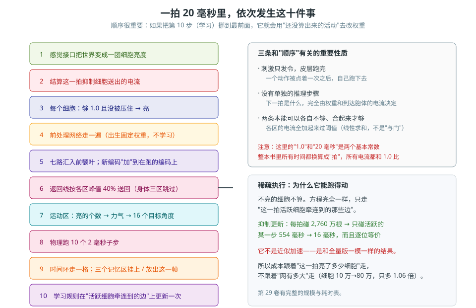

# 第 2 卷　一张总图，走一圈

> **本卷目标**：把第 1 卷那张图，**一个框一个框地走一遍**。
> 走完之后，你应该能闭上眼说出"一拍 = 20 毫秒里，信号经过哪几站"。
>
> 本卷只讲**谁发给谁、为什么**；每个部件的精确规则在第三、四编。

---

## 2.0 一句话原理

> **一拍就是一次接力：世界把感觉交出去，感觉被压缩，压缩后的信号汇到前额叶，
> 前额叶把结果发给肌肉；肌肉动了，世界就变了，下一拍的感觉就不一样了。**

### 生活里的比喻

把它想成一条**环形传送带**：

- 世界的照片贴上传送带（感觉）；
- 传送带先经过一排**压缩滚筒**，把一张很大的图碾成一小块摘要；
- 摘要送到中间那个**车间**（前额叶），车间里一群工人互相递条子；
- 车间往外发两条线：一条**回贴**到那几个压缩滚筒上（等于"我在想一个画面"），
  一条发给**电机**；
- 电机转，传送带本身被推动了，于是**下一张照片就不一样了**。

传送带一圈 20 毫秒。它转多少次都不会停——**因为它没有"开始"和"结束"，只有一直在转**。

---

*图 2-1　一张总图：一拍里信号怎么走一圈。黑箭头是一拍里的主线，红箭头是天生互惠返回线，绿箭头是闭环回到世界。*

## 2.1 第一站：外界 → 感觉前处理 → 压成稀疏放电

### 为什么要这一站

世界给的原始信号**太多了**。一台相机一秒给你 1,920×1,080 那么多点，
如果每个点都直接接进大脑，大脑就得有上亿个细胞。所以第一件事是**压缩**。

但这里的压缩不是"随便挑几个点"，而是**一步一步、只跟邻居打交道地压**。

### 精确规则（编号，第 19 卷会展开）

| 编号 | 规则 |
|---|---|
| 2.1.1 | 感觉前处理是**多层**网络，**每一层的神经元数量都等于输入层的数量**（不逐层变小，而是逐层变"懂"） |
| 2.1.2 | 每个神经元**只连上一层的一小圈邻居**（左右各若干个，首尾相接成一圈） |
| 2.1.3 | 出生时权重随机取一个小区间，**取完就固定不变**了 |
| 2.1.4 | 它按阈值放电：收到的电流够大就亮 |
| 2.1.5 | **这类网络不参与学习。** 它们是"信号处理电路"，必须稳定。学习只发生在皮层上 |

### 输出是什么：一根总线，不是一个答案

压到最后，输出是一小撮**稀疏放电**的细胞。

> 这里要纠正一个几乎所有人第一遍都会犯的错：
> **最后一层的输出不是"我认出这是什么"，它是一根总线**（论文 P1）。
> 它只负责把外围那一大堆通道，压成皮层能接得住的一小撮通道。
> 把这根总线当成"答案"，就等于把"信号调理"误认成"思考"。

### 面 B：在机器狗身上走一遍

| 步骤 | 具体发生什么 |
|---|---|
| ① 狗的眼睛 | 拍下一张 1,920×1,080 的第一人称画面 |
| ② 打成马赛克 | 画面变小成 **24×16** 的格子，每个格子有 **3 个颜色通道** |
| ③ 每个"格子×通道" | 配 **10 对**细胞（一对里一个说"到了"，一个说"没到"），总共 **23,040** 个视觉细胞 |
| ④ 前处理网络 | 一层一层往下压，每层只连上一层的邻居；权重出生就固定 |
| ⑤ 结果 | 一小撮细胞亮着。**这一小撮就是"狗此刻看到了什么"的全部** |

一个视觉细胞大约管 **6.25 度**视角；狗的视野是 **100° × 75°**。

---

*图 2-2　一拍 20 毫秒里的十步顺序，以及三条顺序性质。*

## 2.2 第二站：汇合到前额叶

### 为什么要这一站

视觉、听觉、身体感觉是**分开**来的三路。前额叶的作用是**再压一次**，
把它们合成一个"此刻整体是什么情况"的状态。

> 论文 P3 的原话大意：前额叶把其他几个区**已经压过一次**的信号**再压一次**，
> 然后用**跟别处一模一样的规则**思考。
> 这次压缩**一定会丢信息**——这不是缺陷，是设计的一部分。

### 前额叶在做什么

| 它做的事 | 说人话 |
|---|---|
| **压缩** | 把几路信号揉成一个更小的状态 |
| **联想** | 这个状态和以前哪个状态一起出现过 → 连得强 |
| **专注** | 和"我正在想的事"有关的变强，无关的被压住（第 14 卷、第 26 卷） |
| **记住刚才** | 一个念头能在刺激走了以后还亮一会儿（靠前额叶自己内部的环） |

### 一条容易忽略的设计：通路是**互惠**的

把某个感觉区**送进**前额叶的那些连接，同一条线**也能把前额叶的状态送回去**。

| 送回去送到哪 | 效果（说人话） |
|---|---|
| 送回视觉区、听觉区 | **"想出一个画面 / 想出一个声音"**。人的心盲症（aphantasia）缺的就是这一条 |
| 送回运动记忆、运动皮层 | 一个"正在走路"的状态**可以自己把走路启动**，不用外面有刺激 |

**有一条是故意不对称的**：报告身体状态的那几个区（本体感觉、前庭、身体状态）
**只被前额叶读，永远不被前额叶写**。

> 原因很好懂：**凭空编出来的身体读数不是"随便想想"，那是一条指令。**
> 你要是让自己"想象我的腿现在是断的"，那就不是发呆，是要摔了。

---

## 2.3 第三站：两条出口

前额叶往外发两条线。这两条线是整套设计的**咽喉**，值得单独记住。

| 出口 | 发到哪 | 干什么 | 对应哪一句人话 |
|---|---|---|---|
| **出口一：互惠返回线** | 回到各个感觉区 | 把状态镜像回去 | "**想**出一个东西来" |
| **出口二：发给运动区** | 运动区 | 产生动作 | "**做**出一个动作来" |

### 出口二再往下怎么走

运动区里，**一个肌肉组配 10 个细胞**；肌肉组一共 16 个。

| 概念 | 精确含义 |
|---|---|
| 运动细胞总数 | **160**（16 个肌肉组 × 10 个） |
| **亮的个数 = 力气** | 亮 1 个 = 很小的力；亮 10 个 = 这个肌肉组的最大力 |
| 输出是什么 | 16 个**目标角度** |
| 一拍里身体怎么动 | 每拍跑 **10 个 2 毫秒的物理子步**（合起来正好 20 毫秒） |

> **注意这里没有"读出层"。** 老办法会把隐藏状态再乘一个矩阵翻译成动作；
> 这套方法里，**运动命令就是这 160 个细胞此刻亮着的个数**，没有中间商。

---

## 2.4 第四站：动作改变世界，闭环合上

身体动了，画面就变了，关节角也变了 —— **下一拍的感觉输入就和这一拍不一样了**。

这就是"闭环"的意思，也是这套方法里**唯一**的信息来源：

| 没有闭环会怎样 | 结果 |
|---|---|
| 身体不动 | 感觉永远一样 → 网络永远在同一个状态里打转 |
| 感觉被切断 | 网络在里面自说自话，很快和世界脱节 |
| 只有感觉没有运动 | 那不是一个生物，是一个仪表盘 |

**闭环不是"反馈控制"。** 反馈控制里有一个目标值，有误差，有调节器；
这里没有目标值，也没有人在比较"现在的样子"和"应该的样子"。
只是：感觉进、放电传、肌肉动、世界变、感觉再进。

---

## 2.5 全程挂在旁边的两样东西

### 一、抑制池：8,000 个细胞，专门负责"压住"

如果只有兴奋，一个念头会把整张表点亮。所以有一种**专门的细胞**只干一件事：**压住别人**。

| 规则 | 内容 |
|---|---|
| 数量 | **8,000** 个 |
| 怎么连 | 每个抑制细胞的一半连接落在**自己附近**（半径 4 个细胞），另一半**撒到全表** |
| 权重 | **固定 1.5，永远不改** |
| 关键 | 这是**细胞在抑制**，**不是负权重**。整张网里**一根负权重都没有** |

两半各有各的用处：

- **撒开的那一半**：谁亮得越多，全表收到的抑制电流就越大 → 保证"一个念头不会点亮整张表"（论文 R21）。
- **就近的那一半**：让**互相排斥的编码**不会同时亮（比如"左边有东西"和"右边有东西"）。

### 二、时间环 + 三个记忆区：全系统唯一的时钟

| 规则 | 内容 |
|---|---|
| 时间环 | 时间细胞绕成一圈，**首尾相接** |
| 走一格 | **0.05 秒** |
| 一帧 | **2 格 = 0.1 秒** |
| 绕一圈 | **24 小时** |
| 身份 | **全系统唯一的时钟**。所有记忆区都引用它，别的地方不许自己造时钟 |
| 三个记忆区 | 视觉记忆 / 听觉记忆 / 运动记忆，结构一样 |
| 怎么记 | 两张表：`特征 → 时间` 和 `时间 → 特征` |
| 怎么回忆 | 给一组特征 → 各个时间细胞投票 → 票最多（且明显领先）的时刻胜出 → 从这个时刻开始按时间环把后面的帧**连续放出来** |

---

## 2.6 一句话收尾

> **"想"、"回忆"、"动作"，全都只是放电沿连接在传播；**
> **学习只发生在连接权重上，别的地方什么都不改。**

这句话是全书最重要的一句。后面每一卷，都是在给这句话补证据。

---

## 2.7 怎么验证（本卷的可查项）

| 你想确认的事 | 去哪看 |
|---|---|
| 一拍真的是 20 毫秒吗 | 第 17 卷的精确规则；论文 5.1 |
| 真的没有读出层吗 | 论文 2.1（系统节）；`engine_v2/born_wired/` 里找运动区怎么解码 |
| 真的有 8,000 个抑制细胞、权重 1.5 吗 | 论文 2.1；第 17 卷 |
| 时间环真的是唯一时钟吗 | 论文 2.1 记忆节；第 10 卷、第 22 卷 |
| 整张网真的没有负权重吗 | 论文 2.1 与 2.2；在代码里搜有没有负权重 |

**最硬的一层验证**：双击 `回放_大脑_A.html`，自己看模型开一遍机器人。
你不需要相信任何人的话。

---

## 2.8 常见坑

| 坑 | 症状 | 正确理解 |
|---|---|---|
| **以为每一层神经元在变少** | 画图时逐层画小 | **每层数量和输入层一样**（2.1.1）。变的是"懂什么"，不是"有多少" |
| **以为前处理网络也在学习** | 看到权重随机初始化，就以为它会变 | 前处理网络的权重**出生固定**（2.1.5）。会变的只有皮层那部分 |
| **把返回线当成"正反馈回路"** | 担心它自己把自己越推越亮 | 返回线是**互惠**的：把状态送回感觉区，等于"想出画面"；不是自我点火 |
| **让前额叶去写身体状态区** | 觉得"想象一下我摔了"很自然 | **故意不给写**（2.2）。编出来的身体读数是指令，不是念头 |
| **以为闭环里有目标** | 说"它跑偏了就调整回来" | 没有目标值、没有误差。它只是转圈 |
| **把抑制写成负权重** | 在权重矩阵里写 −2.0 | 网里**没有负权重**（2.5）。抑制由**专门的抑制细胞**完成 |

---

## 2.9 自检三问

1. 不看 2.4 那张表，自己说：如果**把感觉切断**，这套系统会怎样？如果把**运动切断**呢？
   两种坏法不一样在哪？
2. 为什么"最后一层"不是答案层？如果你坚持它是答案层，会导致什么后果？
   （提示：你会漏掉中间层携带的信息——论文 P7 专门讲这件事）
3. 抑制池的一半连"附近"、一半连"远处"。这两半**分别**防的是哪一件事？

