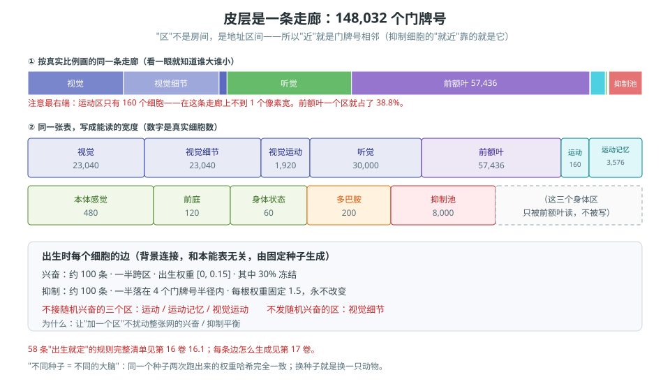

# 第 5 卷　细胞与连接

> **本编的读法**：第二编只回答一个问题——**这个部件为什么存在？**
> 不给精确数字，只给"没有它会坏在哪"。精确数字在第四编。
>
> **本卷目标**：认识这套东西的**底层零件**：细胞、连接、抑制细胞、皮层。
> 这四个词后面全文都要用，这里要把它们钉死。

---

## 5.0 一句话原理

> **细胞只有"亮/不亮"两种状态；连接只有"多粗"一个属性；抑制由一个专门的细胞群来做。**
> 整本书后面所有复杂的东西，都是这三样的排列组合。

### 生活里的比喻

**细胞 = 一屋子电灯开关。** 每个开关只有"开"和"关"，没有"半开"。

**连接 = 电线。** 每根线有个"粗细"。电流从一头流到另一头，粗的过得多。

**抑制细胞 = 一块专门压总闸的继电器。** 它一亮，附近一片灯就被压下去。
注意：它**不是"负的电流"**——它是**另一个开关**，只不过它的作用是把别人按下去。

---

*图 5-1　皮层是一条走廊：148,032 个门牌号。区不是房间，是地址区间。*

## 5.1 细胞：为什么不做"膜电位方程"

真实的神经元有膜电位、有钠钾泵、有几十种离子通道。这套方法**一个都不用**。

| 真神经元 | 这里的细胞 | 为什么可以这么糙 |
|---|---|---|
| 膜电位连续变化 | **只有亮 / 不亮** | 我们要的是"信号在网里怎么流"，不是"一个细胞怎么放电" |
| 有不应期、适应 | 都没有 | 该有的效果（不该同时亮、不能一直亮）由**抑制**和**权重**负责 |
| 一次放电是脉冲 | 一拍 = 亮一次 | 一拍 20 毫秒，足够描述行为 |

**判断规则只有一条**：

> 这一拍**收到的兴奋电流加起来 ≥ 阈值**，就亮；被抑制细胞压住，就不亮。

### 为什么这个"+ 阈值"这么重要

因为它是**唯一**的"比较器"。这句话有个很深的后果，第 1 卷已经说过：

> **没有单独的推理步骤。** 一个念头的下一站是什么，
> **完全由"当前权重"和"此刻到达胞体的电流"决定**。
> 这里没有一行代码在判断"该不该往下走"。

---

## 5.2 连接与权重：一根线到底带什么信息

一根连接上只有**一个数**：权重大小。它表达的是：

> **"源亮了之后，往目标身上送多少电流。"**

只有这些，没有别的：

| 连接上**有**的 | 连接上**没有**的 |
|---|---|
| 一个权重（粗细） | 没有"是不是重要"的标签 |
| 出生权重、下限、上限（结构） | 没有"来自哪一层"的信息 |
| 是否冻结 | 没有"方向对不对"的评分 |
| 可塑倍率 | **没有负数**（见 5.3） |

---

## 5.3 抑制细胞：为什么必须有它

### 没有它会坏在哪

假设只有兴奋连接。会发生两件事：

| 坏在哪 | 具体是什么 |
|---|---|
| **一个念头点亮整张表** | 兴奋会互相传，A 点亮 B，B 点亮 C……很快就全亮了 |
| **互相排斥的编码会同时亮** | "左边有东西"和"右边有东西"会同时为真，系统分不清 |

所以必须有**专门负责压住**的东西。

### 关键选择：**用细胞抑制，不用负权重**

这是全套设计里最容易被改错的一处。两种做法都"能压住"，但含义完全不同：

| | 负权重 | **专门的抑制细胞**（采用） |
|---|---|---|
| 是什么 | 一根连接带负号 | 一个细胞，它亮了就去压别人 |
| 谁在做决定 | **写权重的人** | **细胞自己**（它也遵守同一套放电规则） |
| 能不能被学习 | 可以，但 "负得更多" 是什么意思很难讲 | 可以：抑制的连接也会自己调 |
| 能不能被"去抑制" | 做不到 | 能做到——**再有一种细胞专门压抑制细胞**（第 14 卷） |
| 全书一致性 | 破功 | 一致：**一切都是细胞决定的** |

> **一句话记住**：这个系统里**没有任何一根负权重**。
> 你在本能表里写 `-4.5`，那只是**表格记号**，
> 展开的时候会变成 `源 → 抑制细胞 → 目标`。

### 抑制细胞的两半，各自管什么

抑制细胞不是"随便连连"。它有一半连**很近的邻居**，一半**撒到全表**。

| 哪一半 | 连到哪 | 管什么 | 不管会怎样 |
|---|---|---|---|
| **就近的那一半** | 自己附近（半径 4 个细胞） | 让**互斥编码**不同时亮 | "左边有"和"右边有"会一起亮 |
| **撒开的那一半** | 全表 | **谁亮得多，全表被压得越狠** → 保证一个念头不会点亮整张表（论文 R21） | 一个念头会蔓延到整张表 |

### 就近那一半，为什么**故意做得很短**

这一点非常反直觉，但它是被实测逼出来的：

> **运动记忆是一格一拍的时间线。** 如果就近半径设成几十个细胞，
> 一个本能链的**第一拍就会把后面几拍压掉**——因为它们在时间线上离得太近了。

也就是说：**"附近"这个词在这张表里是有物理含义的**——
它不只是空间上的邻居，还是**时间上的邻居**。半径取多少，是一个要量的决定（第 29 卷）。

---

## 5.4 出生连接：不是到处都撒

出生连接看起来是"随机撒的"，其实有明确的三条例外规则。

| 规则 | 内容 | 为什么（没有它会坏在哪） |
|---|---|---|
| **接受方** | 每个细胞大约 100 条兴奋（一半跨区）、100 条抑制（一半在半径 4 内） | 保证有信号可传、也有压制可用 |
| **权重** | 出生权重落在一个很小的区间里，约 **30% 标为冻结** | 小权重 = "模糊但方向对"；冷冻 = 一辈子的骨架 |
| **区一：运动 / 运动记忆 / 视觉运动** | **不接受**随机兴奋 | 这三个区的输入必须**干净**：让它们听"写好的路线"，不听噪声 |
| **区二：视觉细节** | **不发出**随机兴奋 | 它只往内送，不往外撒，避免扰动全局的兴奋/抑制平衡 |
| **区三：固定种子** | 整张随机连接表用固定种子生成 | **不同种子 = 不同的大脑**。不固定的话，写死的本能就对不上了 |

> **为什么"加一个区"要这么小心**：因为每加一个区，随机连接的**抽样分母**变了，
> 全局的兴奋/抑制平衡就被扰动。这三条规则就是"加区不翻车"的护栏。

---

## 5.5 "皮层"是什么：一个必须钉死的定义

**皮层不是"大脑的外壳"，也不是"某一层网络"。**

> **皮层 = 每个区里，面向大脑内部的那一层。**

| 区 | 它的皮层是网络的哪一层 | 方向 |
|---|---|---|
| 感觉区（视觉、听觉、本体……） | **输出层** | 往外送（送进大脑内部） |
| 前额叶 | **输出层** | 往外送 |
| **运动区** | **输入层** | **方向相反！**（从大脑内部接进来，然后往外解码成肌肉） |

**本能连接就长在这一行皮层神经元之间**——同区内、以及跨区。

为什么运动区方向相反？因为**它的任务是"接命令"，不是"报情况"**。
感觉区是"报情况"（输出自己的状态给内部看），运动区是"接命令"（接收内部的命令然后动作）。

> ⚠️ 有一处**代码和规格不一致**，书里必须说明白：
> 规格写的是"其他区的皮层神经元**直接连到运动区多层网络的输入层**"，
> 而当前代码是连到运动网的**输出层**。
> 这个分叉记在附录 A，不许含糊过去。

---

## 5.6 怎么搭

本卷对应零件 1（细胞表）、零件 2（出生连接表）、零件 7（抑制细胞）。产出：

| 产出 | 要点 |
|---|---|
| **一张细胞表** | 每个细胞一行，按脑区分段；每段有名字、有长度 |
| **一张边表** | 源、目标、权重、出生权重、下限、上限、冻结标记、可塑倍率 |
| **一片抑制细胞** | 单独一段，权重固定；一半就近、一半撒开 |
| **一个固定种子** | 生成随机背景连接用 |

**顺序**：先按种子铺随机背景 → 再把本能表叠上去 → 再挂抑制 → 完事。

---

## 5.7 怎么验证

| 你想确认的事 | 怎么验 |
|---|---|
| 真的没有负权重吗 | 全表扫一遍权重，找有没有小于 0 的 |
| 抑制真的是细胞做的吗 | 看本能表里的 `-4.5` 展开成了什么（应该出现一个抑制细胞） |
| 就近半径真的管时间线吗 | 把半径改大，看本能链是不是"第一拍把后面压掉"了 |
| 三个"不接受 / 不发出"的区真的生效了吗 | 查这些区的入边/出边里有没有随机背景边 |
| 固定种子真的固定吗 | 跑两次，比权重哈希 |

---

## 5.8 常见坑

| 坑 | 症状 | 正确理解 |
|---|---|---|
| **给细胞加膜电位** | 觉得"不够生物" | 这套方法不需要。要的效果由抑制和权重负责 |
| **把抑制写成负权重** | 在边表里写负数 | **没有任何一根负权重**（5.3） |
| **就近半径随手取大** | 觉得"邻居越多越稳" | 运动记忆是**一格一拍**的时间线，半径大了会把后面的拍压掉 |
| **以为皮层就是"最后一层"** | 画图时不区分 | **皮层 = 面向内部的那一层**；感觉区是输出层，**运动区是输入层** |
| **随手改种子** | 觉得种子无所谓 | **不同种子 = 不同的大脑**；本能表会对不上 |
| **给运动区接随机兴奋** | 觉得"多接点没坏处" | 那三个区**故意不接**，为了输入的干净和全局平衡 |

---

## 5.9 自检三问

1. 为什么"抑制用专门的细胞做"和"抑制用负权重做"，在这套设计里**不是一回事**？
   至少说出两条区别。
2. "运动区的皮层是输入层，方向跟别人相反。" 这句话如果画成图，
   你的箭头该怎么画？画完之后回答：为什么运动区必须反过来？
3. 就近半径那件事：为什么**"空间上的邻居"在这里也是"时间上的邻居"**？
   想不出来就回去看 5.3 最后一段。

