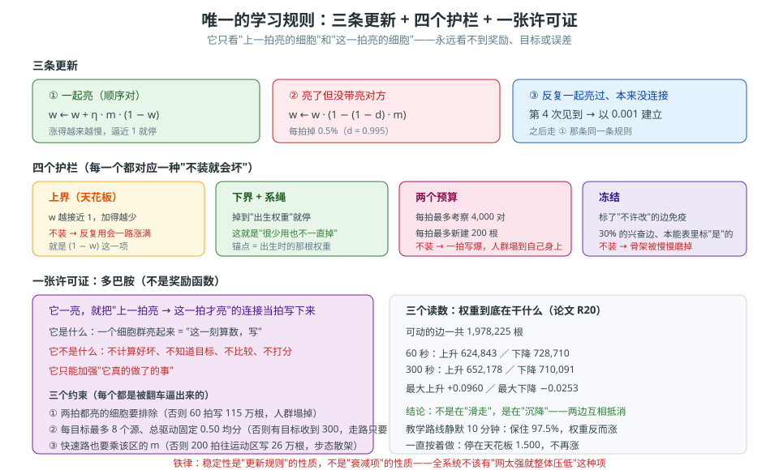

# 第 8 卷　学习规则

> **本卷目标**：第 4 卷讲了这条规则"是什么"，本卷讲它"**为什么非长成这样**"。
> 重点不在公式，在**四个护栏**：每个护栏都对应一种"不装就会坏"的坏法。
>
> 规则本身和参数表在第 4 卷；精确到能照抄的版本在第 20 卷。

---

## 8.0 一句话原理

> **这条规则只允许看"两个细胞"——它不许看整张网，不许看结果，不许看目标。**
> 正是这个"不许"，让它便宜、稳定、并且可以在活着的每一拍上跑。

### 生活里的比喻

老办法的学习像**老师批改整张卷子**：看总分、看错在哪、再回头调整每一道题的解法。

这条规则像**邻里之间传个话**：A 和 B 今天又一起出现了，那 A 到 B 这条小路**踩宽一点**。
没有人告诉它们"你们这样是对的"。

**关键区别**：老师批卷子要**整张卷子**在手；传话**只要这两个人**在场。

---

*图 8-1　唯一的学习规则：三条更新 + 四个护栏 + 一张许可证（多巴胺）。*

## 8.1 为什么它必须"局部"

### 如果它不局部，会付出什么

| 如果不局部（要全局信息） | 后果 |
|---|---|
| 要算"整张网这次表现如何" | 每次更新都得**扫全表**，成本爆炸 |
| 要知道"哪个方向是对的" | 就**必须有目标或误差**——三根柱子又立起来了 |
| 要等一整轮结束才知道该怎么改 | 就**不能在每一拍上跑**，"活着的时候学"这件事就没了 |
| 一处改动会牵动全局 | **不稳定**，而且解释不清是哪里变了 |

> **论文 5.5 有一句话讲得很直白**：**可塑性是"一拍"的一部分，不是这个系统的一种模式。**
> 也就是说，它不是一个"训练阶段"，它就是**活着本身**。

### 所以这条规则长成了那个样子

| 它的特征 | 是被什么逼出来的 |
|---|---|
| 只看上一拍和这一拍的两个细胞 | 要局部、要便宜 |
| 只有加、减、建三种动作 | 要能在每一拍跑 |
| 涨得越来越慢、跌得越来越慢 | 要稳定、不能失控 |
| 永远看不到奖励/目标/误差 | 三条红线 |

---

## 8.2 三个动作，各防一种坏法

| 动作 | 防的是 | 不装会怎样 |
|---|---|---|
| **一起亮就涨** | 什么都不学 | 系统永远停在本能，学不会新东西 |
| **亮着但没带动对方就跌** | 只有涨会让所有连接**一起变粗** | 用不了多久整张表全是满权重，行为糊成一团 |
| **反复一起亮就新建** | "本来没有连接的地方永远没有" | 系统**长不出新路子**，永远只能用出生那张图 |

---

## 8.3 四个护栏：每一个都对应一种坏法

这是本卷的**核心**。学习规则本身很傻，让它可用的其实是这四个护栏。

| 护栏 | 是什么 | 不装会怎样 |
|---|---|---|
| **上界（天花板）** | 每根边有它自己的最大权重 | **反复用会一直涨**，涨到把别的信号全压死 |
| **下界 + 系绳** | 每根边有它自己的最小权重，还有"出生时的权重"把它拉着 | **不用就会掉到零**，把天生会的东西忘光 |
| **预算** | 每拍最多考察多少对、最多新建多少根 | 一拍算不完，**跑得比身体还慢**；或者一拍长出几百万根，**整个人群塌到自己身上** |
| **冻结** | 一部分边标上"不许改" | **一辈子的骨架被慢慢磨掉**，最先坏的是平衡这类反射 |

> **注意"下界 + 系绳"这一条**：它不是"掉到零就停"，而是**"退回它出生的样子就停"**。
> 这就是"**很少用也不会一直掉**"的实现方式——掉到出生权重那里就不掉了。

### 预算这两个数为什么不能随便取

这不是"性能优化"，是**行为问题**：

| 如果不设"每拍最多新建"会怎样（实测） | 结果 |
|---|---|
| 教学时每一拍都写 | 有人试过，60 拍写了 **115 万** 根连接；一个听觉块从 609 个活跃细胞涨到 **2,202**（总共 2,749）——**整个人群塌到自己身上** |
| 不限制"每个目标最多几个源" | 有目标细胞收到 **300** 单位的电流，**而走路只需要 0.85**；任何碰巧亮过一次的细胞都被写满、然后一直亮着 |

**所以：预算是"防塌"的护栏，不是性能开关。**

---

## 8.4 冻结：怎么表达"这一根不许动"

### 为什么必须要有

因为**不是所有天生会的东西都应该被改**。

最典型的例子是**平衡反射**：

| 如果平衡反射会被学 | 会发生什么 |
|---|---|
| 它每次站不稳都会被"共激活" | 体重一变、地面一变，它就**被改写** |
| 改写之后 | 它不再可靠。**一个不可靠的平衡反射等于没有平衡反射** |

### 表达方式有两种，都要知道

| 方式 | 怎么表达 | 用在哪 |
|---|---|---|
| **冻结标记** | 出生连接表上的一列，标上就免疫学习 | 单个突触级别："这一根不许动" |
| **可塑倍率 `m`** | 整区的倍率调得很小 | 区域级别：运动/运动记忆/前庭/本体/身体状态这五个区 |

> **论文原话大意**：**"平衡反射一辈子几乎不变"就是用那一个倍率数字表达的，
> 不是代码里的特例。**

**这句话是范式级的**：能用一个数字表达的，就不要写一段 `if`。

---

## 8.5 多巴胺：它是一张**许可证**，不是分数

第 4 卷已经讲过它的作用，这里只强调**它不是什么**：

| 它不是 | 因为 |
|---|---|
| 不是奖励函数 | 它不计算"这次做得好不好" |
| 不是误差信号 | 它不知道目标是什么 |
| 不是裁判 | 它不比较、不打分、不排序 |
| 不是"老师" | **它只能加强"它真的做了的事"**。一只一直被打赏、但教学时根本没走路的狗，学完还是一步不走 |

**它是什么**：一个细胞群亮起来，就等于说"**这一刻算数，写下来**"。

---

## 8.6 怎么搭

| 产出 | 要点 |
|---|---|
| **每拍的更新过程** | 只看"上一拍亮的 × 这一拍亮的"；**只在活跃细胞牵连到的边上跑** |
| **三个动作** | 涨 / 跌 / 建（建要过门槛） |
| **四个护栏** | 上界、下界 + 系绳、两个预算、冻结 |
| **一个多巴胺块** | 一亮就"当拍共激活立刻写"；每目标最多 8 个源；总驱动固定并均分；再乘该区倍率 |
| **一张"关掉学习"的开关** | 只用来做对照，**不是第二种运行方式** |

> **重要**：更新**必须只在活跃细胞牵连到的边上跑**。
> 以前它是"每拍碰全部 2,760 万根抑制突触"，改成"只碰活跃细胞牵连到的"之后，
> 某一步从 **554 毫秒降到 16 毫秒**，而且**逐位等价**（有专门的对照脚本证明）。

---

## 8.7 怎么验证

| 你想确认的事 | 怎么验 |
|---|---|
| 学习真的每拍都在跑吗 | 关掉和不关掉各跑一次，比权重表 |
| 四个护栏真的生效吗 | 逐个去掉，看会不会涨爆 / 掉光 / 塌掉 / 磨掉骨架 |
| 冻结真的免疫吗 | 只查带冻结标记的边，权重应该**一点都不动** |
| 多巴胺真的只是许可证吗 | 跑"多巴胺不亮"的对照：应该**学不到**，但**别的都正常** |
| 快速路的三个约束真的必要吗 | 逐个去掉，看 8.3 那两种塌法是否重现 |

---

## 8.8 常见坑

| 坑 | 症状 | 正确理解 |
|---|---|---|
| **把学习当成一个"训练阶段"** | 写个 `train()` 再写个 `eval()` | 它是**每一拍**的一部分，从出生就在跑（论文 5.5） |
| **让它看到全局信息** | 传进去"这一轮的总表现" | 一旦要全局信息，就必须有目标/误差——**红线** |
| **护栏全靠"调参"而不是结构** | 手动试出一个不涨爆的参数 | 护栏应该是**结构性**的：上下界、系绳、预算、冻结 |
| **加一条"网络太强就整体压低"** | 觉得更稳 | **红线**。稳定性必须是更新规则自己的性质（论文 P10、第 4 卷 4.3） |
| **冻结写成代码分支** | `if 是平衡反射: 不学` | 应该是**表上一列**或**一个倍率数字** |
| **以为多巴胺是奖励** | 说"它知道这样对" | 它**不知道对错**。它只说"现在写" |
| **忘了"关掉学习"只是对照工具** | 把它当成"推理模式" | 它是**一把用来做归因的刀**，不是另一种运行方式 |

---

## 8.9 自检三问

1. 为什么这条规则"必须局部"？请从**成本**和**红线**两个角度各说一条。
2. 四个护栏里，**哪一个**负责"很少用也不会一直掉"？它和"不掉到零"有什么区别？
3. 有人提了个建议："我们加一条规则：如果整张网太活跃，就把所有连接整体乘 0.99。"
   你怎么回答他？（要点：论文 P10 原话；以及为什么这是红线）

