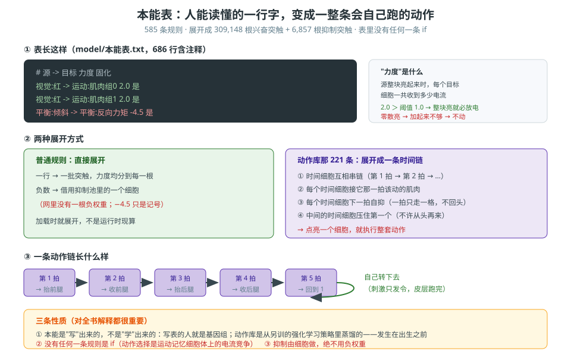

# 第 12 卷　本能与标定

> **本卷目标**：讲清"天生会的那点东西"是怎么**写下来**的。
> 这一卷有两个必须钉死的概念：**力度**到底是什么，以及**名字是怎么来的**。

---

## 12.0 一句话原理

> **本能表是一张纯文本的表，一行一条反应。**
> 表里写的不是代码，是**数据**；加载的时候它被**展开成**连接。

### 生活里的比喻

它就像一张**菜谱**：

- 一行写"**看到红的 → 往前走，力度 2.0，可以改**"。
- 菜谱本身不是厨房，**但它决定了厨房怎么被搭起来**。
- 换一张菜谱 = 换一个天生会的东西。

**写菜谱的人，就是"基因组"。**

---



*图 12-1　本能表：一行中文，展开成一整条会自己跑的动作。*

## 12.1 本能表长什么样

它就是**一行行的中文**，人能直接读懂：

```
视觉:红 -> 运动:肌肉组0  2.0  是
```

从左到右：

| 位置 | 意思 |
|---|---|
| `视觉:红` | **源**：哪一块细胞亮起来的时候 |
| `运动:肌肉组0` | **目标**：要去推动哪一块细胞 |
| `2.0` | **力度**（下面 12.4 专门讲） |
| `是` | 这一条**可以学**吗（"是" = 可塑，"否" = 冻结） |

### 三条关于这张表的纪律

| 纪律 | 为什么 |
|---|---|
| **它是数据，不是代码** | 表里**没有任何一句 `if`**（第 2 卷、第 11 卷都强调过） |
| **文件名和内容都写得清清楚楚** | 本能表是**最后裁判之外的实物**：`model/本能表.txt` |
| **加载时就展开** | 表不是运行时读的规则，而是**生成连接时用的原料** |

---

## 12.2 本能连接包含**三种**

大多数人的直觉里，"连接"只有兴奋。这里不是。

| 种类 | 干什么 |
|---|---|
| **兴奋** | 把目标推起来 |
| **抑制** | 把目标压下去 |
| **去抑制** | **把抑制细胞压下去**（等于"松绑"） |

> 记住第 5 卷那条：**"抑制"是靠专门的抑制细胞做的，不是负权重。**
> 所以本能表里写 `-4.5`，展开的时候会变成 `源 → 抑制细胞 → 目标`。

---

## 12.3 出生时的状态：**模糊的总分布**

本能连接**不是一个精确的线路图**。出生时它长这样：

| 特征 | 意思 |
|---|---|
| **权重小** | 单根连接很弱，要靠**一整块细胞一起亮**才推得动 |
| **随机** | 具体哪根连到哪个细胞是撒的 |
| **方向大致对** | 总体上，确实是在往对的那个方向推 |

之后它会慢慢变，而且**不是一起变**：

| 类别 | 命运 |
|---|---|
| **高度可塑** | 会被学习规则慢慢改 |
| **几乎固化** | 出生是多少，差不多一辈子就是多少 |

（第 3 卷已经专门讲过"写"和"学"的分界线，这里不重复。）

---

## 12.4 **力度**：本卷最重要的一个词

本能表里那个 `2.0` **不是"一根连接的粗细"**。这是最容易搞错的地方。

### 正确定义

> **力度 = 源那一整块细胞亮起来时，每个目标细胞一共收到多少电流。**
> 如果这一条规则有 N 根突触，力度会**自动均分到每一根**上。

### 为什么这个定义很重要

因为它直接决定"**整块亮**"和"**只亮一小部分**"的区别：

| 情况 | 结果 |
|---|---|
| **整块源细胞全亮** | 每个目标细胞收到完整力度 → **一定过阈值、一定放电** |
| **只亮一小部分源细胞** | 加起来**不够** → **目标不动** |

**这就给了本能表一个天然的"防误触"**：不是"碰到一点点就触发"，
而是"**这一整件事真的发生了**才触发"。

### 负力度是什么意思

同一个意思，方向相反：

> **正力度 = 一共送进去多少电流。**
> **负力度 = 一共压掉多少电流。**

而且实现上就是"实际权重 = |力度| / 抑制强度"，**和正力度用的是同一套换算**。

---

## 12.5 **名字**是怎么来的：标定

本能表里写的 `视觉:红` 这个"红"，**不是代码里定义的**。它是**量出来的**。

### 正确的做法：标定

> **① 点亮一个物理条件**（渲染一张图 / 放一段声音 / 摆一个姿势）
> **② 跑一遍对应的前处理**
> **③ 记录输出层哪些细胞响应了** → 那些就是这个名字
> **④ 减去参考条件的结果**

第 ④ 步不能省：**一个方向的名字 = 该方向渲染的结果 − 参考条件的结果**。
不减去参考，你会把"一直都在亮的背景"当成这个方向的特征。

### 一个失败的做法（必须记住的反例）

有人试过用**编号**来写本能："红色应该落在输入层某某编号区间"。

| 做法 | 打中比例 |
|---|---|
| 满屏红时，皮层亮的细胞落在"输入层红色编号区" | **6.1%** |
| 随机碰运气 | **6.7%** |

**等于没有。** 这就是"**不能用编号写本能**"这条规矩的来历。

---

## 12.6 本能连接的范围**很广**

不要以为本能只是"几个反射"。它覆盖：

| 覆盖到哪 | 说明 |
|---|---|
| 各区皮层**内部**的连接 | 同一个区里的细胞之间 |
| **跨区**的连接 | 视觉 → 运动、听觉 → 运动记忆…… |
| **前额叶**自己的连接 | 包括前额叶内部的环 |

### 而且它**不需要"继承"**

这一条第 3 卷讲过，这里再落一次地：

> **本能连接就是这张网的初始状态，不是两张网。**
> 赫布学习在**同一张网**上继续长。
> 代码里你不需要真的去"继承上一代、再糊一层"——**直接把初始连接写成你要的样子**。

---

## 12.7 这张表有多大（第 24 卷展开）

给个量级，让你有感觉：

| 项 | 数量 |
|---|---|
| 规则条数 | **585 条**（581 条写在表里 + 4 条来自派生反射表） |
| 展开成兴奋突触 | **309,148 根** |
| 另有抑制突触 | **6,857 根** |

**585 条怎么分组、每组的条数、每条的确切含义，在第 24 卷一条一条列。**

---

## 12.8 怎么搭

| 产出 | 要点 |
|---|---|
| **一张本能表** | 纯文本；一行一条；源、目标、力度、是否可塑 |
| **一套展开程序** | 把每一行按"力度均分到每根突触"展开成连接 |
| **一套标定程序** | 点亮条件 → 跑前处理 → 记录响应 → **减参考** |
| **一份派生反射表** | 那 4 条来自这里 |

**三条纪律**：表是数据；不能按编号写；方向名必须标定。

---

## 12.9 怎么验证

| 你想确认的事 | 怎么验 |
|---|---|
| 表真的是数据吗 | 打开 `model/本能表.txt` —— 应该是一行行中文，没有 `if` |
| 力度真的"整块亮才触发"吗 | 只点亮源的一小部分，看目标动不动 |
| 负力度真的变成"抑制细胞"了吗 | 追一条负力度的展开结果，应该出现一个抑制细胞 |
| 标定的名字靠得住吗 | 用**没参与标定**的条件去测 |
| 编号真的不行吗 | 复现那个 6.1% vs 6.7% 的对照 |
| 真的没有"继承"这一步吗 | 查代码：本能表和随机背景是不是写进了**同一张边表** |

---

## 12.10 常见坑

| 坑 | 症状 | 正确理解 |
|---|---|---|
| **把力度当成"一根连接的粗细"** | 调一根线去改力度 | 力度是**整块源给每个目标的总电流**，会自动均分（12.4） |
| **用编号写本能** | "红色 = 某某编号" | 实测 6.1% vs 随机 6.7%，**等于没有**（12.5） |
| **标定不减参考** | 把背景当特征 | **名字 = 条件结果 − 参考结果** |
| **以为负力度是负权重** | 在边表里写负数 | `-4.5` 是**表格记号**，展开成 `源 → 抑制细胞 → 目标` |
| **以为本能是一个小模块** | 只写几条反射 | 它覆盖区内 + 跨区 + 前额叶，**范围很广**（12.6） |
| **真的去写"继承 + 加噪"** | 多此一举的流程 | 那是**讲给人的比喻**，代码里直接写初始状态（12.6） |

---

## 12.11 自检三问

1. 力度 `2.0` 的定义是什么？为什么这个定义能实现"**整块亮才触发**"这个防误触效果？
2. 你打算怎么给"**左边有红球**"这个方向起名字？请列出四个步骤，
   并说明**第四步为什么不能省**。
3. 如果有人说"本能表就是一堆规则，那不就是写死的 `if` 吗"，你怎么回答？
   （要点：它是**数据**；展开成的是**连接**；动作是被**抢**出来的，没有一句 `if`）

