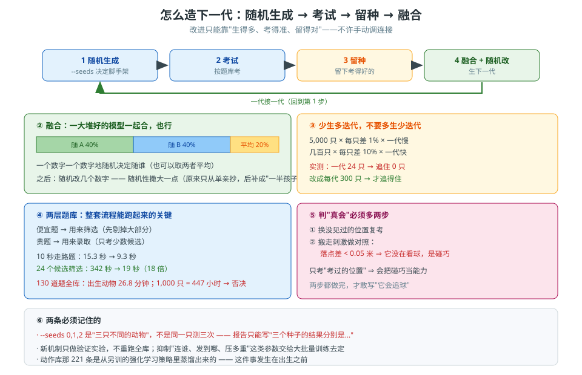

# 第 36 卷　怎么造下一代：随机生成 + 题库 + 融合

> **本卷目标**：给出**能跑起来的一整套流程**：怎么生出下一代、怎么筛、怎么融合、
> 怎么不把时间浪费在没必要的重跑上。

---

## 36.0 一句话原理

> **"基因"就是本能表上那几个数字。**
> 繁衍 = **随机生成 → 考试 → 留种 → 再生**。
> **不许手动调连接**——改进只能靠**生得多、考得准、留得对**。

### 生活里的比喻

**育种**，不是**调机床**。
你不去拧每一个螺丝，你让**一批批种子**去长，然后**留下长得好的**。

---

*图 36-1　怎么造下一代：随机生成 → 考试 → 留种 → 融合，以及两层题库和两个必做的复考。*

## 36.1 "基因"是什么

| 项 | 说明 |
|---|---|
| 基因 = | **本能表上那几个（后来是几十个）数字** |
| 不是基因的 | 学习规则、抑制、相反细胞、时间与记忆、演化流程——**这些是"物种"，不是"个体"** |

> **所以"演化"只调**那一小撮数字**，不动脑子里那套通用机制。**

---

## 36.2 一次繁衍的四步

| 步 | 做什么 |
|---|---|
| 1 | **随机生成**：拿一批基因，各生成一只（`--seeds` 决定脚手架） |
| 2 | **考试**：按题库考 |
| 3 | **留种**：留下考得好的 |
| 4 | **生下一代**：从留种的里面繁殖 |

---

## 36.3 繁殖：融合 + 随机改

| 做法 | 比例 |
|---|---|
| 每个数字随 A | **40%** |
| 每个数字随 B | **40%** |
| 每个数字取**两者平均** | **20%** |
| 之后 | **随机改几个数字** |

**融合不一定要两两做**：**一大堆好的模型一起融合也行**，各种方法都试。

> **一条被补上的漏洞**：追球那条接法原来**只从单亲抄、没有两爹融合**。
> 后来补成"**一半孩子两爹融合**"。

---

## 36.4 留种按什么排：一张权重表

用户 2026-10-01 把这件事定死了，三句话：

> - "**要根据整体评分来保留模型**，整体都很优秀的模型融合后产生后代。"
> - "**跑得快的权重应该更高，追到球和跑得快是最重要的两个。**"
> - "**还有不摔的权重也要高。**"

所以留种**不看单项**，看一张权重表算出来的**综合分**（0~1，越大越好）。

| 格 | 权重 | 怎么换算成 0~1 |
|---|---|---|
| `follows` **真追住球** | **.27** | 追住的趟数 ÷ 总趟数 |
| `fast` **跑得快** | **.22** | 追球那两趟**平均跑了多少米** ÷ **6** |
| `steady` **站得稳** | **.15** | （全程最低直立分量 − 0.3）÷（0.9 − 0.3） |
| `in_view` 球在正前方 | .10 | 本身就是 0~1（球在正前方的时间占比） |
| `settled` 跑完落后 | .08 | （3 − 落后几米）÷ 3 |
| `static` 静止球到了没 | .05 | 到了算 1，没到算 0 |
| `approach` 追近了 | .04 | 追近的米数 ÷ 1.5 |
| `closest` 最近贴到 | .03 | （1.5 − 最近几米）÷ 1.5 |
| `both` 两边都会 | .03 | 是算 1，否算 0 |
| `straight` 走得直 | .03 | 直度（0~1） |

**前三格加起来 .27 + .22 + .15 = .64**——追到球、跑得快、不摔，就是这三样说了算。

**摔了的直接给 −1**：不管别的格多高，一律排到所有没摔的后面。

> **代码在哪儿**：`engine_v2/tools/evolve_chase.py` 里的 `SCORE_WEIGHTS` 和 `overall()`。
> 表就是表，没有藏在别处的第二份。

**融合爹也按这张表选**：从爹里挑综合分**最高的前 8 只**，**平均成一只**，
一半孩子从这只"融合爹"变异来。这就是用户说的"**整体都很优秀的模型融合后产生后代**"。

---

## 36.5 抬权重时的两个坑（本轮真踩到的）

用户说"把某某的权重提高"，如果那一格本身是**是/否**、或者分母是**随手写的**，
**抬了等于没抬**。两个坑都踩过，都改了。

**坑一：一格是"是/否"的，抬权重不改名次。**

"不摔"原来就是**摔没摔**——是或否。
可排名第一眼看的就是摔没摔，摔了的**永远**排在没摔的后面。
所以把这一格从 .04 抬到 .15，**名次一点不变**，只是分数好看。

> **改法：把它从"是/否"改成"离摔倒线还有多远"。**
> 每趟都记下**全程最低的那个直立分量**（1 = 站得笔直，**0.3 = 摔了**，
> 跟"判摔"用的是同一条线），取所有趟里最低的一个，
> 再按 `(最低值 − 0.3) ÷ (0.9 − 0.3)` 换算成 0~1。
>
> **实测（六批第 0 代，没摔的 193 只）**：
> 这个最低值中位数 **0.985**，可最低的一只只有 **0.394**——离 0.3 那条线只差一点。
> 也就是说，**没摔的狗里面有 10%（19 只）的最低值低于 0.9**。
> 旧写法里这 19 只全拿满分、和新写法里 0.985 的那些**一模一样**；
> 新写法里它们这一格只换算到 **0.16**（满格是 1.0），折成权重分就是 **0.024 分**，
> 比满格的 **0.15 分**少拿 **0.13 分**。
> "不摔的权重要高"这才**真的生效**。

**坑二：分母随手写，好模型全顶到满分。**

"跑得快"原来是"跑了多少米 ÷ **5**"。
**实测（六批第 0 代，没摔的 193 只）**：
这一格读的是追球那两趟**平均跑了多少米**，中位数 **3.85 米**、最远 **9.29 米**。
除以 5 的话有 **26%** 的模型直接顶到满分 1.0；改成除以 **6**，只剩 **8%**。

> **一句话**：**权重抬得动的前提，是那一格在留种池里真的分得开。**
> 一个格子在池子里人人满分，给它再大的权重也是白给——**先看分布，再谈权重**。

---

## 36.6 一个关键的取舍：**少生多迭代 vs 多生少迭代**

| 策略 | 一代几只 | 特点 |
|---|---|---|
| 多生少迭代 | **5,000** | 每只差 **1%**；一代慢 |
| **少生多迭代** | **几百** | 每只差 **10%**；**一代快** |

**实测**：一代 **24 只太少**（追球**追住 0 只**），后来改成 **每代 300 只**。

> **结论**：**总工作量差不多，但迭代速度差很多。**
> 随机性撒大一点，用"**少量 × 多代**"代替"**大量 × 少代**"。

---

## 36.7 判"真追住"要多做两步

光"考过了"不算数。必须加：

| 步 | 做什么 | 判据 |
|---|---|---|
| 1 | **换没见过的位置复考** | 换个球位它还追不追 |
| 2 | **把球搬走做对照** | **落点差 < 0.05 m 就是"没在看球"** |

> **第 2 步是"排除碰巧"的核心**：如果有没有球它落点都一样，
> 那它追的**不是球**，是"**碰巧往那边走**"。

---

## 36.8 题库：130 道，和它的两个数

| 项 | 值 |
|---|---|
| 题目总数 | **130** |
| 出生动物跑全库 | **1,609 秒**（26.8 分钟） |
| 1,000 个候选跑全库 | **447 小时** |

> **447 小时直接否决了"每只都考全库"**。所以需要 36.9 那套流程。

---

## 36.9 一场很值得抄的自审（题库到底有没有用）

有人专门审了一遍题库，结果查出**四类问题**：

| 问题 | 说明 |
|---|---|
| **两道题是废的** | 测的东西和别的题重复 / 测不出差别 |
| **一道题读法是错的** | 判据读的不是它以为在读的东西 |
| **一个基因在搜索里等于不存在** | 这个数字改了也不影响结果——**白留了一个自由度** |
| **题库对自己说的话是死文本** | 题目的说明文字**没有真的被用上** |

> **这一条比任何一道题都值钱**：它说明**题库本身也要被考**。
> 题库里的每一道题都该问一句：**"它真的能区分好坏吗？"**
>
> 具体的一个例子（用户举例过的那类问题）：
> "**没人管它，它是一直走还是走两步就停**"——**走和停都无所谓，这题区分不出好坏**。
> 要改成："给它一个目标/信号，**看它到不到**"。

---

## 36.10 提速：两个实打实的数

| 优化 | 结果 |
|---|---|
| 10 秒走路题 | **15.3 秒 → 9.3 秒** |
| 24 个候选筛选 | **342 秒 → 19 秒**（**18 倍**） |

> **筛选用"便宜的题"，录取用"贵的题"** —— 这是整套流程能跑起来的关键。

---

## 36.11 一条最重要的省时间纪律

> **用户原话（大意）**：
> **"不需要每次都把实验全部重新跑一遍。** 做一个**额外实验**验证一下就行，
> 不然下次又加新机制，又要重新跑所有实验，**根本没必要**。"

**所以：**

| 情形 | 该做什么 |
|---|---|
| 加了一个新机制 | **只做验证这个机制的实验**（一到几个），不是全库重跑 |
| 机制的参数（比如抑制"连谁、发到哪、压多重"） | **不单独做实验**——它们属于**要靠大批量训练定的参数** |
| 改了一个实现 | 跑**零回归**：确认正常模型**一个字节都没动** |

> **为什么参数不单独试**：用户说得很清楚——
> **"到时候整批训练就能解决的事"**。
> 你要判断的是"**机制可不可行**"，不是"这组参数最优不最优"。

---

## 36.12 一件必须记住的事：`--seeds 0,1,2` 是**三只不同的动物**

| 你以为 | 实际上 |
|---|---|
| 同一只动物测三次 | **三只不同的随机动物**（一个种子同时决定**随机脚手架、身体复位、初始朝向**） |

> **这个工程里没有"同一只动物、不同物理噪声"的对照。**
> 所以报告时**不能说**"重复三次结果一致"，只能说"**三个种子的结果分别是……**"。

---

## 36.13 动作库从哪来（出生之前的那道工序）

| 项 | 说明 |
|---|---|
| 动作库那 221 条 | 从**另训的强化学习策略**里**蒸馏**出来 |
| 这件事发生在 | **出生之前** |
| 所以它**不是** | 活着时候的监督 |

> **再强调一次**：**动物活着的时候，全程没有奖励、没有目标、没有误差。**

---

## 36.14 怎么搭

| 产出 | 要点 |
|---|---|
| **一张基因表** | 本能表上那几个数字；**每个数字都要能影响结果**（36.9 那个坑） |
| **一个繁衍器** | 随机生成 → 考试 → 留种 → 融合（40/40/20 + 随机改） |
| **一套两层题库** | **便宜题**用于筛选，**贵题**用于录取 |
| **两个必做的复考** | 换位置复考 + 搬走刺激对照 |
| **一个零回归检查** | 改动后确认正常模型逐位一致 |
| **一张权重表** | 留种按**综合分**排；每一格换算成 0~1，权重见 36.4。**摔了的直接给 −1** |
| **一个融合爹** | 从爹里挑综合分**前几名，平均成一只**，一半孩子从它变异 |
| **一条纪律** | 新机制**只做验证实验**，不重跑全库 |

---

## 36.15 怎么验证

| 你想确认的事 | 怎么验 |
|---|---|
| 基因真的有效吗 | 改这个数字，看结果**变不变**。不变＝这个自由度是假的 |
| 题目真的能区分好坏吗 | 拿"明显好"和"明显坏"的模型各跑一遍，看分数**分不分得开** |
| 是它真追球还是碰巧 | **搬走球**：落点差 < 0.05 m 就是没在看球 |
| 它是真认东西还是认位置 | **换没见过的位置**复考 |
| 繁衍有没有效果 | 每代留下最好的几只，看**代与代之间**有没有进步 |
| 一次改动有没有弄坏别处 | 零回归：正常模型**逐位一致** |
| **某一个格子在留种池里分得开吗** | 把这一格在**整代候选**里的值排一遍，看**中位数和最大端**。人人都满分＝这一格白给（36.5 坑二） |
| **抬了权重以后，名次动了没** | 比对抬权重前后留下来的那几只。**一模一样＝没抬动**，多半因为那格是“是/否”（36.5 坑一） |

---

## 36.16 常见坑

| 坑 | 症状 | 正确理解 |
|---|---|---|
| **每加一个机制就重跑全部** | 时间全耗在重跑上 | **只做验证实验**（用户明确说过） |
| **为了调参数专门做实验** | 试"快基因占多少最合适" | 那是**大批量训练**的事；你只需判断**机制可行** |
| **一代生太多** | 一代跑几个小时 | **少生多迭代**，随机性撒大 |
| **一代生太少** | 24 只——追住 **0** 只 | **每代几百只** |
| **只考"考过的位置"** | 以为是通用能力 | **换没见过的位置**复考 |
| **不做"搬走刺激"的对照** | 把碰巧当能力 | 落点差 < 0.05 m 就是没看球 |
| **题目本身不审** | 废题、错读法、假自由度混在里面 | **题库也要被考** |
| **把 `--seeds 0,1,2` 当重复实验** | 报告写成"三次一致" | 那是**三只不同的动物** |
| **以为动物活着时用了强化学习** | 看到"蒸馏"就误解 | 蒸馏在**出生之前** |
| **手动调连接** | 手改几根线 | **红线**；改进只能靠生 + 考 + 留 |
| **把“是/否”的格子抬权重** | 抬了 .04 → .15，留下来的还是那几只 | 先把它换成**连续量**（比如“离摔倒线还有多远”），权重才抬得动 |
| **分母随手写** | 好模型全顶到满分，快慢分不出来 | **先量分布再定分母**：看中位数和最远端各在哪 |

---

## 36.17 自检三问

1. 为什么"一代 24 只"不行，而"一代 300 只"行？请用**随机性**和**迭代速度**各说一条。
2. 如果题库里有一道题，好模型和坏模型都得满分，这道题的问题出在哪？
   你会怎么改它？请举一个具体的例子。
3. 用户说"新机制只做一个验证实验就行"。**为什么**这样做是安全的？
   请从"**你要判断的是什么**"这个角度回答。
