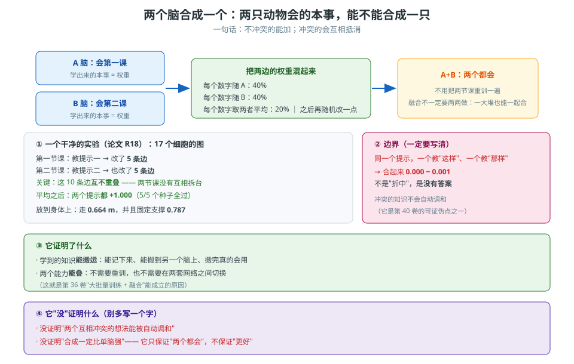

# 第 39 卷　两个脑合成一个

> **本卷目标**：讲清"**两只动物会的本事，能不能合成一只**"，
> 以及**它的边界**——什么时候合得成、什么时候合不成。

---

## 39.0 一句话原理

> **把两个脑的权重按比例混起来，然后随机再改一点。**
> **两件事各教了一半的，合起来两件都会**；
> **同一件事教了相反的，合起来什么都不会。**

### 生活里的比喻

两个人各学了一门手艺，**笔记混在一起** → 两门都会。
两个人学同一门手艺、但**一个人学的是对的、一个学的是错的** →
混起来**互相抵消**，结果什么都不会。

---

*图 39-1　两个脑合成一个：怎么合、R18 那个干净实验、以及"冲突的会互相抵消"这条边界。*

## 39.1 怎么合（最简版本）

| 做法 | 比例 |
|---|---|
| 每个数字随 A | **40%** |
| 每个数字随 B | **40%** |
| 每个数字取**两者平均** | **20%** |
| 合成之后 | **再随机改一点** |

> **"融合不一定要两两做"**：**一大堆好的模型一起融合也行**，各种方法都试。

**相关脚本**：`engine_v2/tools/fuse_parents.py`、`fuse_robot_parents.py`、`merge_models.py`、
`check_merge_identity.py`、`merge_cloud_eye.py`

---

## 39.2 一个干净的实验：**两节课各教一半（论文 R18）**

| 项 | 值 |
|---|---|
| 网络 | 一个 **17 个细胞**的小图 |
| 第一节课 | 教提示一 → **改了 5 条边** |
| 第二节课 | 教提示二 → **也改了 5 条边** |
| **关键** | 这 5 条边**互不重叠** |
| 合成办法 | **平均** |
| 结果 | **两个提示都能做到 +1.000** |
| 稳定性 | **5/5 个种子** |

> **"互不重叠"是这里的关键**：两节课**没有互相拆台**，所以合起来**两件事都在**。

### 身体上的同一个实验

| 项 | 结果 |
|---|---|
| 融合之后 | **走了 0.664 m** |
| 并且 | **固定支撑 0.787** |

**两个能力同时保留。**

---

## 39.3 边界：**同一提示教了相反的答案**

| 情形 | 合成后 |
|---|---|
| 同一提示，一个教"这样"、一个教"那样" | **0.000 ~ 0.001** —— **没有答案** |

> **这就是融合的边界**：
> **不冲突的能加；冲突的会互相抵消。**
> 而且抵消之后**不是"随便选一个"，而是"两个都不够"**——**结果是"没有答案"**。

---

## 39.4 一句必须遵守的纪律：先问"能力，不先改连接"

用户说过一句很关键的话：

> **"你不要手动调整连接，我就问你——融合后的模型是否同时拥有两个能力？
> 能跑步和眼睛盯着吗？"**

**这句话定了验收标准**：

| 该问的 | 不该做的 |
|---|---|
| 融合后**是不是同时拥有两个能力** | **手动去改几根连接**让它"看起来会" |

> **如果融合后倒地、不走，正确反应是"找问题根源"，不是"手改几根线把它扶起来"。**
> 手改出来的能力**没法复现、也长不大**——这是红线（第 30 卷）。

---

## 39.5 一个常见现象：融合之后变差了，为什么

**先说结论：这很可能是正常的，但必须查清是哪一种。**

| 可能的原因 | 怎么分辨 |
|---|---|
| 两个父本**在同一件事上学到了相反的答案** | 看那件事在合成后是不是**变成"没有答案"**（39.3） |
| 两个父本的**脚手架种子不同**，混起来不匹配 | 检查是不是**换种子才能变好** |
| **融合比例**把某一方的关键数字抹平了 | 试着**只融合一部分**，看是哪一块在拖后腿 |
| 合成的那个模型**本来就没被复考过** | **按第 37 卷复考**：换位置 / 搬走刺激 |

> **不要盲目改。先找根源**——这是用户强调过的。

---

## 39.6 融合之后必须做的事

| # | 做什么 |
|---|---|
| 1 | **保留所有能力**（每一项都按第 37 卷复考） |
| 2 | **生成新模型**（在融合的基础上再随机生成一批） |
| 3 | **用同一套题库考**，和父本对比 |
| 4 | **报出每一项的分**，不要只报最好那一项 |

---

## 39.7 两个老想法的渊源（论文 2.2 / P19）

| 老想法 | 在这套方法里的形态 |
|---|---|
| **中枢模式发生器**（Grillner & Wallen 1985）：触发后自己跑完的动作程序 | **走路链**（第 23 卷） |
| **时间细胞**（Eichenbaum 2014）：一个动作瞬间一个细胞 | **时间环**（第 22 卷） |

> **提这两个不是为了攀亲戚，是为了说明**：
> 这套方法里的不少零件，**不是新发明，是把老想法做成了可运行的形态**。

---

## 39.8 怎么搭

| 产出 | 要点 |
|---|---|
| **一个融合脚本** | 40% / 40% / 20% + 随机改；也支持"一堆一起融" |
| **一个"能力清单"** | 每一项能力配一个判据（第 37 卷） |
| **一个冲突检测** | 检测"同一件事在父本里是不是相反" |
| **一条纪律** | **先看能力，不手改连接** |

---

## 39.9 怎么验证

| 你想确认的事 | 怎么验 |
|---|---|
| 两件事真的都在吗 | 两项能力**分别**复考，都要过 |
| 是不是碰巧 | 用**多个种子**跑（本例 5/5） |
| 冲突真的会抵消吗 | 故意教一个"相反答案"，看结果是不是 **0.000~0.001**（没有答案） |
| 融合有没有把哪一项弄坏 | 用**同一套题库**分别考父本和子代 |
| 融合身份有没有搞错 | `check_merge_identity.py` 一类工具核身份 |

---

## 39.10 常见坑

| 坑 | 症状 | 正确理解 |
|---|---|---|
| **手改连接让融合体"会"** | 扶一把 | **红线**；先问"有没有这个能力" |
| **只验一项能力** | 另一项悄悄坏了都不知道 | **每一项分别复考** |
| **两个父本学的是相反答案** | 合成后**什么都不会** | 先检测冲突（39.3） |
| **以为"冲突就随便选一个"** | 期望值错了 | 冲突的结果是"**没有答案**" |
| **只用两个父本融** | 以为必须两两 | **一堆一起融**也行 |
| **融合后不复考** | 把"看起来正常"当"能力都在" | 必须按第 37 卷复考 |
| **融合出问题就盲目改** | 越改越乱 | **先找根源** |

---

## 39.11 自检三问

1. 为什么"两节课各改 5 条**互不重叠**的边"能合成出"两件事都会"，而"同一提示教相反答案"就变成"没有答案"？
2. 用户说"不要手动调整连接，我就问你融合后是不是同时拥有两个能力"。
   这句话在**验收标准**上给了你什么？
3. 一只融合体既不会走也不站得稳。在**动任何代码之前**，你会先做哪三件事？
