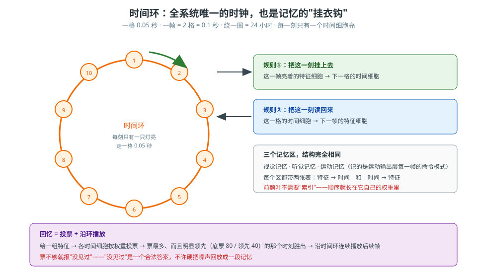

# 第 22 卷　时间与记忆的精确规则

> **本卷目标**：把"**时间从哪来、记忆存在哪、怎么想起来**"写成能照抄的规则。
> 这一块在论文里几乎没有，**主要出自架构文档与用户的明确要求**，所以要写全。

---

## 22.0 一句话原理

> 全系统**只有一个时钟**：一圈时间细胞，首尾相接，每走一格就是一小段时间。
> 记忆不是"存内容"，是"**存'哪个时刻有哪些细胞亮着'**"。
> 想起来 = **投票**，票最多而且明显领先的那个时刻胜出，然后**沿着环往下播**。

### 生活里的比喻

想象一个**挂钟的钟面**，但它不是指针在转，而是**一整圈灯泡轮流亮**：

- 第 1 秒 1 号灯亮，第 2 秒 2 号灯亮……转一圈回到 1 号。
- 你在某个时刻看到一幅画面，就把这幅画面**挂在当时亮着的那只灯上**。
- 以后你想回忆，就先按画面去找：**所有挂着这幅画面的灯一起投票**，
  **票最多的那只灯**就是"当时是几点"。
- 找到时刻以后，就**沿着环一圈一圈播下去**——这就是"把整段记忆放一遍"。

---

*图 22-1　与图 10-1 同一张，放在这里方便照着抄数字。*

## 22.1 时间环：全系统唯一的时钟

| 项 | 值 |
|---|---|
| 形状 | 时间神经元**绕成一圈，首尾相接** |
| 走一格 | **0.05 秒** |
| 一帧 | **2 格 = 0.1 秒** |
| 绕一圈 | **24 小时** |
| 谁在用 | **所有记忆区都引用它**——它是**全系统唯一的时钟** |

### 三条必须记住的性质

| 性质 | 为什么重要 |
|---|---|
| **只有一个钟** | 如果每个区自己造一个时钟，**时间就对不上了**——用户明确强调过这一条 |
| **一帧 = 2 格，不是 1 格** | 留一格给"过渡"，记忆才不会**粘连**（相邻两帧不至于糊在一起） |
| **绕一圈 = 24 小时** | 一天的尺度，够用；再长就得重开一圈 |

### 一个思想渊源（不是凭空的）

> **"一个动作瞬间一个细胞"** = Eichenbaum (2014) 讲的**时间细胞（time cells）**。
>
> 也就是说：这不是凭空想出来的，它是把"时间细胞"接成**一整圈**。
> 出处：论文 2.2。

---

## 22.2 三个记忆区，结构完全相同

| 记忆区 | 记什么 |
|---|---|
| **视觉记忆** | 视觉那一帧的特征模式 |
| **听觉记忆** | 听觉那一帧的特征模式 |
| **运动记忆** | **运动输出区每一帧的输出层命令模式**（和视 / 听一致） |

**每个记忆区都带两张连接表**：

| 表 | 规则 |
|---|---|
| **`特征 → 时间`** | 上一帧的特征细胞 → **下一格**的时间神经元 |
| **`时间 → 特征`** | 上一格的时间神经元 → **下一帧**的特征细胞 |

> **两张表是一对**：一张负责"把这一刻挂上去"，一张负责"把这一刻读回来"。
> **这就是完整的一套记忆。**

---

## 22.3 回忆：投票 + 沿环播放

| 步骤 | 规则 |
|---|---|
| 1 | 给一组特征（比如"我现在看到的东西"） |
| 2 | 各时间细胞**按权重投票** |
| 3 | **票最多、而且明显领先第二名**的那个时刻胜出 |
| 4 | **不够就报"没见过"**——不乱回放 |
| 5 | 找到时刻后，**沿时间环连续播放后续帧** |

### 判据的具体数字

| 项 | 值 |
|---|---|
| 底票 | **80** |
| 领先 | **40** |

**怎么理解这两个数**：

| 数 | 意思 |
|---|---|
| 底票 80 | 票太少（< 80）就说明**根本没有匹配的东西**——报"没见过" |
| 领先 40 | 只多一两票不算赢——**噪声也能多一两票**，所以必须**明显领先** |

> **"没见过"是一个合法答案。** 这一点很关键：
> 一个只会硬答的系统，会把噪声也回放成一段记忆。

---

## 22.4 一条被用户否掉的设计：**前额叶不需要海马体索引**

| 提议 | 用户的回答 |
|---|---|
| 给前额叶加一个"索引 / 地址"，好让它"按顺序想事情" | **不需要**——"**前额叶本身靠赫布连接，本身就有时间顺序**" |

### 为什么不需要

| 理由 | 说明 |
|---|---|
| 顺序已经长在权重里 | 前额叶内部的连接**是它自己长出来的**；"上一件事 → 下一件事"就是权重 |
| 加索引等于加外挂 | 索引是**外部的东西**；一加，你就要维护它、同步它、修复它 |
| 加索引会引入新故障 | 会产生"**忘了第几步**"这种故障——而现在这种故障**根本不存在** |

> **这句话的价值在于它反过来证明了一件事**：
> **顺序可以是"结构的副产品"，不需要一个专门的"序号零件"。**

---

## 22.5 三条和"顺序"有关的重要性质

| 性质 | 说人话 |
|---|---|
| **刺激只发令，皮层跑完** | 一个动作被点着一次之后**自己跑下去** |
| **没有单独的推理步骤** | 下一拍是什么，完全由当前权重和到达胞体的电流决定 |
| **两条本能可以各自不够、合起来才够** | 各区的电流**全加起来**过阈值才算（不是"与门"） |

### 一条最实用的推论

> **走路是自循环：点着一次就永远走。**
>
> 所以"**只点一次走路链的头细胞**"是一个**诊断手法**：
> 如果它走了两步就停，说明**这条链自己没转起来**——问题在权重，不在"没人催它"。

---

## 22.6 怎么搭

| 产出 | 要点 |
|---|---|
| **一圈时间细胞** | **首尾相接**；每格 0.05 s；一帧走 2 格；一圈 24 小时 |
| **一个"当前时刻"** | 每一刻**只有一个时间细胞亮**，全系统共用 |
| **三个记忆区** | 视觉 / 听觉 / 运动；**记的是输出层的命令模式** |
| **两张表 / 每个区** | `特征 → 时间`（下一格）、`时间 → 特征`（下一帧） |
| **一条回忆规则** | 投票；**底票 80、领先 40**；不够就报"没见过"；够就沿环播放 |
| **一条纪律** | **不要给前额叶加索引** |

---

## 22.7 怎么验证

| 你想确认的事 | 怎么验 |
|---|---|
| 全系统真的只有一个钟吗 | 查代码：时间环应该**只有一份**；各记忆区都引用它 |
| "一帧 = 2 格"真的更稳吗 | 改成 1 格再跑，看记忆会不会**粘连**（相邻帧混在一起） |
| 回忆真的会报"没见过"吗 | 喂一个**从没出现过的模式**，应该返回"没见过"，不是硬答 |
| 票数阈值真的有用吗 | 把"领先 40"去掉，看会不会**被噪声带着乱回放** |
| 前额叶真的有时间顺序吗 | 不加任何索引，只点一次它的头细胞，看顺序能不能自己跑下去 |
| 走路链真的自循环吗 | **只点一次**走路的头细胞，应该**一直走下去** |

---

## 22.8 常见坑

| 坑 | 症状 | 正确理解 |
|---|---|---|
| **每个区自己造一个钟** | 时间对不上 | **全系统唯一时钟**，用户明确强调过 |
| **一帧只走一格** | 相邻记忆**粘连** | 一帧 **2 格**，留一格给过渡 |
| **回忆只看"票最多"** | 噪声也能赢 | 还要**明显领先**（领先 40） |
| **不会说"没见过"** | 硬把噪声回放成记忆 | "没见过"是**合法答案** |
| **给前额叶加索引** | 以为"有序 = 要有序号" | **不需要**；顺序就是它自己的赫布权重 |
| **以为记忆要"存内容"** | 想着存一段录像 | 存的是**"哪个时刻哪些细胞亮"** |
| **把"时间环"和"心跳"混为一谈** | 以为它只是计时 | 它是**索引**：记忆就是挂在它上面的 |

---

## 22.9 自检三问

1. 为什么"一帧 = 2 格"而不是 1 格？如果改成 1 格，最先出问题的是哪一类任务？
2. 回忆为什么必须"票最多**而且**明显领先"？请举一个只看"票最多"就会出错的场景。
3. 论文里说前额叶"**没有钟可对**"。如果有人一定要给它加一个索引，
   他会付出什么代价？请从"**外部的东西**"这个角度回答。
