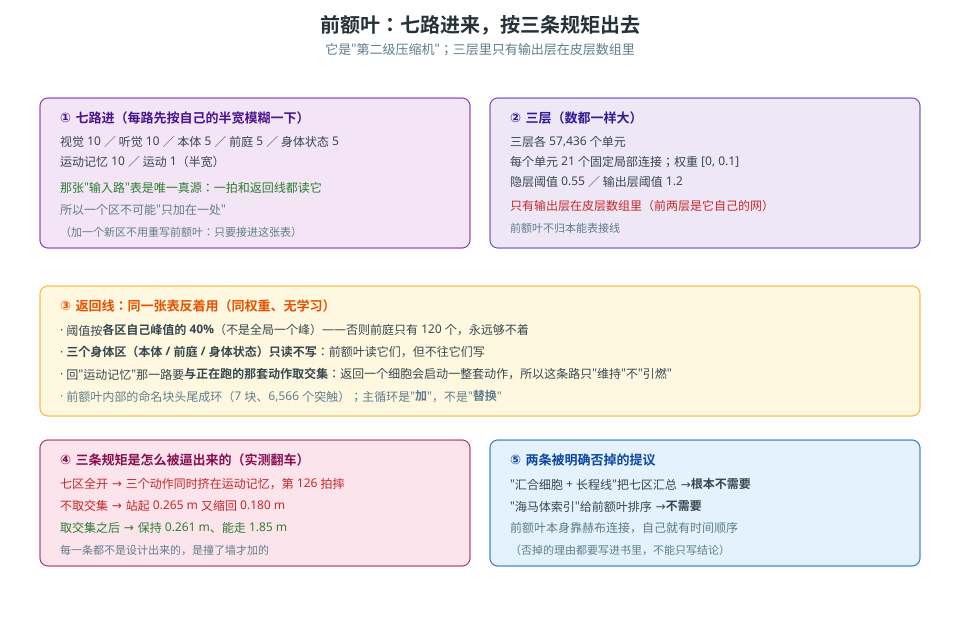

# 第 25 卷　前额叶的精确规则

> **本卷目标**：把前额叶的每一根线、每一个阈值写清楚，**包括它翻过的三次车**。
> 前额叶是整套系统里**唯一一个"第二级压缩机"**，也是**唯一一个能把信号送回去的出口**。

---

## 25.0 一句话原理

> **七个区把信号压进前额叶，前额叶再把信号压一次。**
> 压完之后有两条出口：**一条往回送（天生互惠返回线）**、**一条发给运动区**。
>
> **它不归本能表接线。** 它坐在自己的三层前馈网络后面。

### 生活里的比喻

前额叶像一个**会议室**：七个部门各有代表进来发言（七路输入），
会议把这七路话**合成一份纪要**（压缩），然后**把纪要抄送回去**（返回线）——
抄回去的时候，有些部门**能收到抄送**，有些**只准发言、不准被抄送**。

---

*图 25-1　前额叶全貌：七路输入、三层、返回线的三条规矩、以及"七区全开/不取交集"那两次翻车。*

## 25.1 七路输入，每路先"模糊"一下

| # | 输入路 | 模糊半宽（个细胞） |
|---|---|---|
| 1 | 视觉 | **10** |
| 2 | 听觉 | **10** |
| 3 | 本体感觉 | **5** |
| 4 | 前庭 | **5** |
| 5 | 身体状态 | **5** |
| 6 | 运动记忆 | **10** |
| 7 | 运动 | **1** |

**"模糊半宽"是什么意思**：进来的信号先**在邻居里摊开一下**（± 这么多细胞）。
宽一点 = 更"糊"、更稳；窄一点 = 更精确。

> **运动那一路半宽只有 1**（几乎不模糊）：因为运动区只有 160 个细胞、每组 10 个，
> **再糊就分不出是哪组肌肉了**。

### `输入路` 那张表是唯一真源

| 规则 | 意思 |
|---|---|
| 一拍时读它 | 前额叶每拍按这张表收信号 |
| **返回线也读它** | 往回送的时候，**用的是同一张表反着用** |

> **所以一个区不可能"只加在一处"**：你把它加进 `输入路`，
> 它**同时**获得了"进前额叶"和"从返回线收抄送"这两件事。
> 这条设计防的正是"**加了一个区，忘了接线**"。

---

## 25.1.1　加一个新区**不用重写前额叶**

| 项 | 规则 |
|---|---|
| 加一个**新区** | **不用**改前额叶的网络结构 |
| 只要 | 把它接进 **`输入路`** 那张表 |
| 为什么 | 那张表是**唯一真源**：一拍和返回线**都读它**（25.1） |

> 这也解释了为什么"**加区**"是一件便宜的事：
> 改的是**一张表**，不是**一段代码**。
> 反过来说——如果你发现"加一个区需要改前额叶的代码"，那就是**接错地方了**。

## 25.2 三层前馈网络（前额叶自己那套）

| 项 | 值 |
|---|---|
| 三层各有多少单元 | **57,436**（和皮层里的前额叶区同宽） |
| 每个单元的固定局部连接 | **21** 条 |
| 权重范围 | **[0, 0.1]** |
| 隐层阈值 | **0.55** |
| 输出层阈值 | **1.2** |
| 哪一层**真的在皮层数组里** | **只有输出层** |

**为什么只有输出层在数组里**：因为**只有输出层是"皮层细胞"**——
它是别的区能看见、能连的那一面。前两层是它自己的内部线路。

**为什么输出层阈值（1.2）比隐层（0.55）高**：输出层要**更挑**，
不然前额叶会把所有进来的东西都往外播。

---

## 25.3 出口一：天生互惠返回线

| 项 | 规则 |
|---|---|
| 是什么 | **同一张网反着用**（同样的邻居表、同样的固定权重） |
| 有没有学习 | **没有可塑性**（这一条线是天生固定的） |
| 阈值怎么定 | 用**各区自己的峰值**的 **40%** |
| 为什么不用全局一个峰 | 否则**大区定标**，前庭区（只有 120 个细胞）**永远够不着** |
| 它是前额叶的什么 | **出口** |

### 怎么理解这条线（一个很有用的比喻）

| 返回线坏掉 | 像什么 |
|---|---|
| 送不回去 | **心盲症 / 心失语症**——"想得出，但脑子里既没有画面也没有声音" |

> **这就是"想出一个东西"的实现**：不是凭空造一个画面，
> 而是**把信号镜像着送回原来那些感觉区**，让它们**再亮一次**。

---

## 25.4 出口二：发给运动区

| 规则 | 说明 |
|---|---|
| 前额叶输出层 → 运动区 | 这是"**我打算做什么**"变成"**我做**"的那一步 |
| 到运动区之后 | 走第 23 卷那套：反向赫布网络 → 肌肉 |

---

## 25.5 三条"防幻觉"的决定（每一条都是翻车换来的）

### 决定一：**三个身体感觉区只读不写**

| 区 | 有没有返回线 |
|---|---|
| 本体感觉 / 前庭 / 身体状态 | **没有** |
| 其余四路（视觉、听觉、运动记忆、运动） | 有 |

**为什么**：这三个区是**身体的事实**。
"我想出一个画面"和"我想出一个**身体读数**"**性质完全不同**——
前者是回忆，后者是**凭空编造自己的身体状态**。

**翻车记录**：七区全开时，这三个区分别出现了 **12–22 / 17 / 13 个返回细胞**——
也就是前额叶在**编造身体读数**。

### 决定二：**返回运动记忆的那条路，要和"正在跑的细胞"取交集**

| 规则 | 说明 |
|---|---|
| 返回一个运动记忆细胞会怎样 | **启动一整套动作** |
| 所以这条路只 | **维持**，**不引燃** |
| 怎么做到 | **与正在跑的那些细胞取交集** |

**翻车记录（第一次）**：七区全开时，**三个动作同时在运动记忆里**，
结果第 **126 拍摔**。

**翻车记录（第二次）**：改成"回运动记忆"但**不取交集**：
站起来 **0.265 m**，然后**又缩回 0.180 m**——
原因是第 **51 拍**时，返回线送回了"**躺下**"那个动作的头细胞。

**修好之后**：保持 **0.261 m**，并且走了 **1.85 m**。

> **这一条最值得学**：修法**不是删掉这条路**（删掉就失去了"想出一个动作"的能力），
> 而是**取交集**——**让它只维持、不引燃**。

### 决定三：主循环是"**加**"，不是"**替换**"

| 项 | 说明 |
|---|---|
| 前额叶内部有**命名块头尾成环** | 7 块，共 **6,566** 个突触 |
| 这些环给主循环的信号 | **加上去**（不是替换掉原来的输入） |

**为什么不能替换**：一替换，"**想出一个画面**"那种能力就没了——
因为原来的输入被覆盖掉了。

---

## 25.6 一条被否掉的提议：**不要"汇合细胞 + 长程线"**

| 提议 | 用户的回答 |
|---|---|
| 加一个"汇合细胞"和一条长程线，把七个区汇总起来 | **根本不需要** |

**为什么不需要**：七个区**各自先模糊一下，然后已经压进同一片 57,436 个细胞了**。
再加一条汇总线，等于**在已经汇合的地方再汇合一次**——
**多了个会坏的零件，没有任何新能力**。

---

## 25.7 一条必须照实说的配置说明

> **论文里的 R1–R8，是在"关掉前额叶持久化"（`前额叶不保留`）的配置下跑的。**

意思是：那些实验里，前额叶的编码**每一拍从输入重算，不保留上一拍的状态**。
**R9 和标记为"持久"的那些行，两种配置并排报。**

> **不写这一条，读者会以为所有实验都跑在同一个配置上。**

---

## 25.8 怎么搭

| 产出 | 要点 |
|---|---|
| **一张 `输入路` 表** | 七路 + 各自的模糊半宽；**一拍和返回线共用它** |
| **一个三层前馈网络** | 每层 57,436、每单元 21 条固定局部连接、权重 [0,0.1]、隐层 0.55、输出层 1.2 |
| **只有输出层进皮层数组** | 前两层是内部线路 |
| **一条天生互惠返回线** | 同一张表反着用、同权重、**无学习**；阈值用**各区自己峰值的 40%** |
| **三个身体区不接返回线** | 只读不写 |
| **返回运动记忆取交集** | 只维持、不引燃 |
| **内部环是"加"不是"替换"** | 7 个命名块头尾成环，共 6,566 个突触 |

---

## 25.9 怎么验证

| 你想确认的事 | 怎么验 |
|---|---|
| 七路真的都进来了吗 | 逐个区点亮，看前额叶输出层有没有响应 |
| 模糊半宽真的生效了吗 | 只亮一个细胞，看前额叶响应是不是**摊开成一片** |
| 返回线真的没有学习吗 | 跑一段后比对返回线权重，应该**一点没变** |
| 40% 峰值阈值真的必要吗 | 换成全局峰值，看**前庭区（120 个细胞）**还能不能收到返回 |
| 身体三区真的不被写吗 | 查那三个区有没有收到返回信号——**应该是 0** |
| 交集真的必要吗 | 关掉取交集，看会不会**送出一个"躺下"的头细胞**（25.5 决定二） |
| 环是"加"还是"替换" | 只跑内部环、不给输入，看原来那份输入是否还在 |

---

## 25.10 常见坑

| 坑 | 症状 | 正确理解 |
|---|---|---|
| **给七个区都开返回线** | 前额叶开始**编造身体读数** | 三个**身体区只读不写** |
| **返回运动记忆不取交集** | 站起来又缩回去（送了"躺下"的头细胞） | **与正在跑的细胞取交集** |
| **把返回线当成"学习出来的"** | 以为它会变 | 它是**天生固定的**，同权重无学习 |
| **返回线用全局峰值定阈** | 前庭区永远收不到 | 用**各区自己峰值的 40%** |
| **内部环"替换"主循环** | "想出一个画面"的能力没了 | 是**加**，不是替换 |
| **加"汇合细胞 + 长程线"** | 多一个会坏的零件 | **不需要**；七个区已经汇进同一片细胞了 |
| **忘了报"前额叶不保留"这个配置** | 读者以为实验都同配置 | R1–R8 是**关掉持久化**跑的 |
| **把前额叶也当成"要写本能表"的区** | 接线表里出现前额叶 | 前额叶**不归本能表接线** |

---

## 25.11 自检三问

1. 为什么返回线的阈值要用"**各区自己的峰值**"的 40%，而不是全局一个峰？请用**前庭区只有 120 个细胞**来解释。
2. "三个身体感觉区只读不写"——请说清"**想出一个画面**"和"**想出一个身体读数**"**性质上**差在哪里。
3. 返回运动记忆那条路，**删掉**和**取交集**，分别会失去什么、保住什么？
